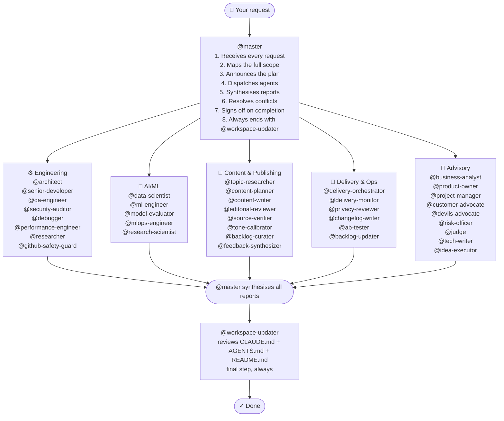

# claude-team-kit

A production-ready workspace kit for Claude-style coding tools. It gives any repo a professional AI team through agent prompts, skills, rules, hooks, and persistent memory.

This repo is a team-definition layer, not a standalone orchestration runtime. It focuses on reusable workspace structure and operating conventions rather than tmux workers, background daemons, or execution HUDs.

## What's Inside

```text
.claude/
├── agents/          38 specialized agents across engineering, AI/ML, content, delivery, and advisory
├── skills/          17 reusable skills (code-review, fix-bug, business-case, create-pr...)
├── rules/           Modular rule files — Python, TypeScript, security, testing, git, performance, API design, AI/ML workflow
├── hooks/           Shell automations (auto-format, secret detection, file protection...)
└── agent-memory/    Persistent per-agent memory (grows over time)
BACKLOG.md           Durable backlog for ideas, deferred work, and future improvements
CLAUDE.md            Master project briefing — customize per project
AGENTS.md            Compatibility briefing for tools that read AGENTS.md
.mcp.json            MCP server config (GitHub pre-configured)
docs/                Workflow and architecture documentation
scripts/             Setup and validation helpers
.env.example         Optional local environment template
```

## Quick Start

1. Use this repo as a template or copy it into your project root
2. Run `./scripts/setup.sh`
3. Fill in `.claude/settings.local.json` and/or `.env` with your `GITHUB_TOKEN`
4. Edit `CLAUDE.md` for the target project you want the kit to describe
5. Run `./scripts/doctor.sh`
6. Start a Claude session and address `@master`

## What This Repo Is

- A reusable workspace kit for agent-based development
- A curated team of 38 agents with explicit collaboration patterns
- A prompt and guardrail layer that can be dropped into another project

## What This Repo Is Not

- A standalone orchestration daemon
- A CLI worker runtime
- A token analytics platform
- A replacement for execution engines such as OMC

---

## How Orchestration Works

**Every request goes through `@master`. Always.**

You never call specialist agents directly. You talk to `@master`, and it decides who runs, in what order, and whether things happen in parallel or sequentially — then synthesises everything back into one coherent response.

Even if a user does not explicitly mention `@master`, or names a specialist directly, `@master` remains the first and only orchestrator in the main thread.

By default, `@master` also reports which agents were selected, what each one did, and the outcome of the orchestration run. Users should not need to ask explicitly for that visibility.



**The orchestration loop — what `@master` does on every request:**

```
RECEIVE → ANALYSE scope → PLAN pipeline → ANNOUNCE plan to user
  → DISPATCH agents (parallel where independent, sequential where dependent)
  → COLLECT all reports → SYNTHESISE findings → RESOLVE conflicts
  → DECIDE: more work needed? → loop | user decision needed? → surface it | done? → sign off
  → TRIGGER @workspace-updater → COMPLETE
```

`@workspace-updater` runs automatically as the last step after significant work. It reviews the core docs (`CLAUDE.md`, `AGENTS.md`, and `README.md`) even when no edits are ultimately required.

**Parallel vs sequential — `@master` decides:**

> *"Add authentication to the API"*
> → **Parallel:** `@architect` + `@researcher` (no dependency between them)
> → **Then sequential:** `@senior-developer` (needs both outputs)
> → **Then parallel:** `@qa-engineer` + `@security-auditor` (both review independently)
> → **Then sequential:** `@risk-officer` → `@workspace-updater`

> *"Plan and publish next week's newsletter"*
> → **Sequential:** `@backlog-curator` → `@topic-researcher`
> → **Then parallel:** `@content-planner` + `@source-verifier`
> → **Human approval gate** → `@content-writer`
> → **Then parallel:** `@editorial-reviewer` + `@tone-calibrator` + `@source-verifier`
> → **Then sequential:** `@privacy-reviewer` → `@delivery-orchestrator` → `@workspace-updater`

> *"Evaluate and operationalize a churn model"*
> → **Sequential:** `@data-scientist` (problem framing, baselines, feature intent)
> → **Then:** `@ml-engineer` (training pipeline and reproducible implementation)
> → **Mandatory gate:** `@model-evaluator` (metrics, fairness, release readiness)
> → **Then:** `@mlops-engineer` (rollout, monitoring, lifecycle)
> → **Optional advisory:** `@research-scientist` when a novel approach or literature review is needed

**See full workflow diagrams** with all collaboration patterns (parallel stages, gated reviews, feedback loops, dual-track launches, and idea-to-plan execution) in [`docs/AGENT_WORKFLOWS.md`](docs/AGENT_WORKFLOWS.md).

---

## The Full Team (38 Agents)

### Core Engineering

| Agent | Role |
|---|---|
| `@master` | **Superagent & orchestrator** — default entry point for every session |
| `@senior-developer` | Clean, production-ready implementation |
| `@architect` | System design and technical decisions |
| `@debugger` | Deep debugging and root-cause analysis |
| `@researcher` | Technology research and best practices |
| `@qa-engineer` | Test plans, coverage, edge cases |
| `@security-auditor` | Vulnerability scanning and hardening |
| `@github-safety-guard` | Final pre-commit/pre-push review for secrets and sensitive disclosures |
| `@performance-engineer` | Profiling and optimisation |
| `@workspace-updater` | Reviews and updates `CLAUDE.md`, `AGENTS.md`, and `README.md` after every significant task |

### AI/ML

| Agent | Role | Model |
|---|---|---|
| `@data-scientist` | Problem framing, exploratory analysis, feature strategy, baseline design, statistical validation | **opus** |
| `@ml-engineer` | Training pipelines, reproducibility, model packaging, inference-oriented ML engineering | sonnet |
| `@model-evaluator` | Mandatory quality gate for metrics, fairness, robustness, explainability, and deployment readiness | **opus** |
| `@mlops-engineer` | Rollout strategy, monitoring, model lifecycle operations, incident and rollback planning | sonnet |
| `@research-scientist` | Literature review, benchmark critique, frontier-method assessment, novelty-vs-complexity judgement | **opus** |

### Content and Publishing

| Agent | Role | Model |
|---|---|---|
| `@topic-researcher` | Finds fresh, source-backed topics for any content workflow | sonnet |
| `@content-planner` | Builds structured multi-edition editorial plans | sonnet |
| `@content-writer` | Writes polished content for any publication format | **opus** |
| `@editorial-reviewer` | Final quality gate before any content is published | sonnet |
| `@source-verifier` | Verifies all claims are backed by strong, current sources | sonnet |
| `@tone-calibrator` | Ensures voice and complexity match the target audience | sonnet |
| `@feedback-synthesizer` | Turns audience responses into backlog topics and planning input | sonnet |
| `@backlog-curator` | Scores, prioritises, and prunes content or feature backlog | sonnet |

### Delivery and Operations

| Agent | Role | Model |
|---|---|---|
| `@delivery-orchestrator` | Renders, gate-checks, and delivers content via any configured channel | sonnet |
| `@delivery-monitor` | Reviews delivery reports and flags errors or anomalies | sonnet |
| `@privacy-reviewer` | Mandatory scan before any public release or repository push | sonnet |
| `@changelog-writer` | Generates versioned changelog entries after releases or publications | sonnet |
| `@ab-tester` | Designs and analyses A/B tests for headlines, CTAs, subject lines | sonnet |
| `@backlog-updater` | Captures ideas and deferred work into `BACKLOG.md` with a consistent schema | sonnet |

### Advisory

| Agent | Role |
|---|---|
| `@product-owner` | User stories, acceptance criteria, scope decisions |
| `@project-manager` | Timelines, blockers, sprint planning |
| `@business-analyst` | Requirements, ROI, business cases |
| `@customer-advocate` | End-user and reader experience, UX empathy |
| `@devils-advocate` | Challenges assumptions before committing to a direction |
| `@risk-officer` | Risk, compliance, "what could go wrong" |
| `@judge` | Final evaluation — business and technical verdict |
| `@tech-writer` | Docs, README, architecture diagrams |
| `@idea-executor` | Turns ideas into validated execution plans, flow diagrams, and step-by-step guides |

---

## Automatic Delegation Rules

These fire automatically — you don't need to ask:

- Secrets / auth / credentials touched → `@security-auditor` reviews first
- New feature or script → `@qa-engineer` writes the test plan
- Architectural decision → `@architect` weighs in
- AI/ML exploratory or feature work → `@data-scientist` leads
- AI/ML model training or pipeline implementation → `@ml-engineer` leads
- AI/ML release readiness → `@model-evaluator` is the mandatory gate
- AI/ML deployment or monitoring design → `@mlops-engineer` leads after evaluator sign-off
- Novel AI/ML methods or benchmark questions → `@research-scientist` advises
- "Backlog this" or defer-for-later requests → `@backlog-updater` updates `BACKLOG.md`
- Significant idea discussions → `@idea-executor` shapes the idea into an execution plan
- Durable architecture, policy, workflow, or repo-structure decisions → `@master` proposes an ADR by default
- Content ready to publish → `@editorial-reviewer` must pass it first
- Before any public release or push → `@privacy-reviewer` runs mandatory scan
- Before any commit or push → `@github-safety-guard` reviews staged or pending changes and `@master` surfaces the findings
- Before major release → `@risk-officer` final sign-off
- After any significant task → `@workspace-updater` runs last and reviews the core docs automatically

## Default Reporting

For significant work, `@master` should report:

- which agents were selected
- what each agent owned
- what happened during execution
- the synthesized outcome, conflicts, and blockers

This reporting is part of the default orchestration behavior, not an optional extra.

## ADR Decision Flow

ADRs are not special-case paperwork. They are the default traceability mechanism for durable decisions.

- If a discussion changes architecture, policy, workflow, repo structure, or long-lived operating conventions, `@master` should propose an ADR by default
- `@architect` owns the technical substance of the decision
- `@devils-advocate` and `@judge` help pressure-test the reasoning
- `@tech-writer` writes the final ADR once the user approves saving it
- `@workspace-updater` then aligns the rest of the repo docs

`@master` must still ask for explicit approval before writing anything into `docs/adr/`.

---

## Key Skills (Slash Commands)

`/code-review` `/fix-bug` `/implement-feature` `/write-tests` `/refactor`
`/security-audit` `/optimize-performance` `/write-docs` `/explain-code`
`/git-commit` `/create-pr` `/business-case` `/sprint-planning` `/research`
`/daily-standup` `/retrospective`

---

## Agent Groups at a Glance

The 38 agents split into five groups designed to cover any project type:

**Engineering** (10 agents) — builds and maintains software: architecture, implementation, testing, security, performance, debugging, and release safety.

**AI/ML** (5 agents) — covers model-centric work from exploratory analysis through training, evaluation, deployment readiness, and frontier-method assessment.

**Content & Publishing** (8 agents) — runs any periodic publication workflow: research → planning → writing → review → tone → sourcing → feedback → backlog.

**Delivery & Ops** (6 agents) — operates the release and distribution pipeline: delivery, monitoring, privacy, changelog, experimentation, and backlog persistence.

**Advisory** (9 agents) — provides strategic and decision-making support: product, project, business, UX, devil's advocate, risk, judgement, docs, and idea-to-plan execution shaping.

---

## Setup and Validation

- `./scripts/setup.sh` makes hook scripts executable and creates local config files from examples when needed
- `./scripts/doctor.sh` checks repo structure, JSON validity, hook permissions, and key documentation references
- `python3 -m unittest discover -s tests -v` runs the lightweight validation test suite for hooks and doctor behavior
- `docs/ARCHITECTURE.md` explains the product boundary and canonical sources
- `docs/PROJECT_CUSTOMIZATION.md` shows how to turn the generic kit into a real project briefing

## Customizing for Real Projects

When you copy this kit into a live repo, keep the shared `.claude/` layer mostly intact and make the repo-specific details explicit in `CLAUDE.md` and `AGENTS.md`.

Good project briefings usually add:

- real stack, commands, deployment flow, and environment rules
- route or page inventories for app repos
- domain-specific gotchas that prevent agent mistakes
- automatic delegation rules that reflect the actual codebase
- documentation sync targets for route catalogs, brief docs, or other registries

## Idea Artifact Policy

Planning outputs should be stored professionally and consistently:

- keep early idea exploration in chat
- save deferred work in `BACKLOG.md`
- save approved execution plans in `docs/plans/`
- save approved architecture or policy decisions in `docs/adr/`

`@master` must ask for explicit approval before saving anything into `docs/plans/` or `docs/adr/`.

## Customisation

- Edit `CLAUDE.md` to configure the project name, stack, commands, and notes
- Use `BACKLOG.md` as the durable registry for deferred work and captured ideas
- Use `docs/PROJECT_CUSTOMIZATION.md` when adapting the kit to a specific repository
- Add project-specific rules with `@.claude/rules/your-rule.md` in `CLAUDE.md`
- Create new agents in `.claude/agents/` — copy any existing file and update the frontmatter and instructions
- Add skills in `.claude/skills/your-skill/SKILL.md`
- Hook scripts auto-run — configure which fire in `settings.json`
- Agent memory grows automatically in `.claude/agent-memory/<agent-name>/MEMORY.md`

## Documentation

| File | What it covers |
|---|---|
| `CLAUDE.md` | Project or repo briefing for Claude-compatible tools |
| `AGENTS.md` | Compatibility briefing for tools that consume AGENTS.md |
| `README.md` | Kit overview, agent roster, orchestration model |
| `docs/ARCHITECTURE.md` | Product boundary, canonical sources, maintenance priorities |
| `docs/PROJECT_CUSTOMIZATION.md` | How to adapt the generic kit to a concrete repo |
| `docs/AGENT_WORKFLOWS.md` | Detailed workflow diagrams with parallel/sequential/gated patterns |

`README.md`, `CLAUDE.md`, and `AGENTS.md` must stay in sync. Update them together whenever the agent roster, workflow, commands, or project structure changes. `@workspace-updater` handles this automatically after major tasks — or call it explicitly after manual changes.
