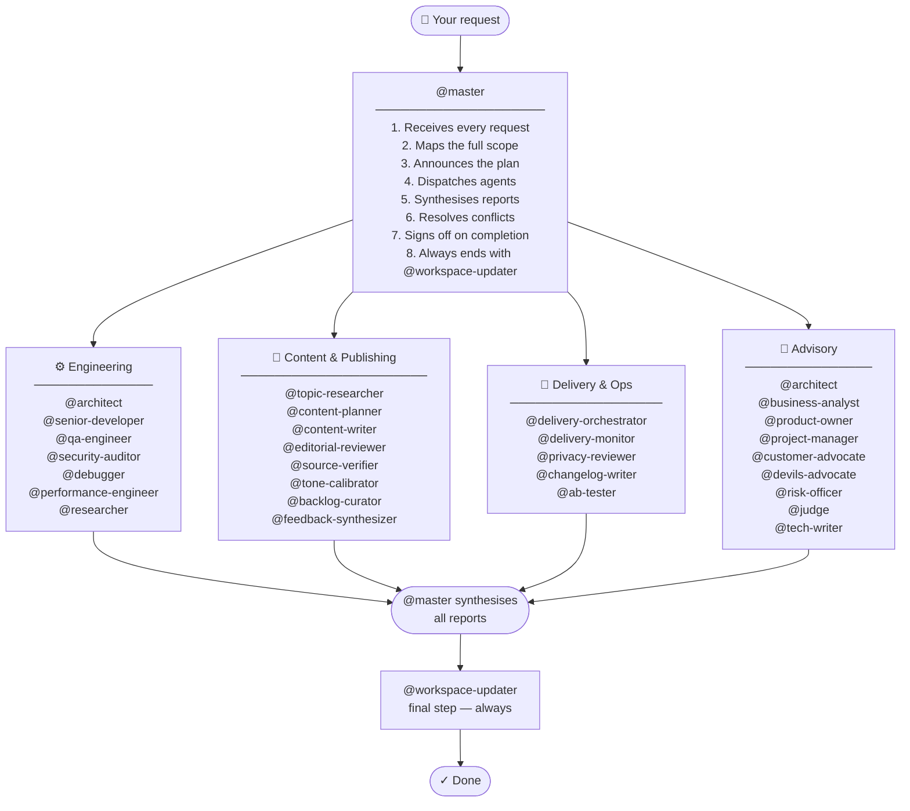

# claude-team-kit

A production-ready Claude workspace starter kit — copy into any project to get a full professional team of AI agents, rules, skills, hooks, and persistent memory working immediately.

## What's Inside

```
.claude/
├── agents/          30 specialized agents across engineering, content, delivery, and advisory
├── skills/          15+ slash commands (code-review, fix-bug, business-case, create-pr...)
├── rules/           Modular rule files — Python, TypeScript, security, testing, git, performance, API design
├── hooks/           Shell automations (auto-format, secret detection, file protection...)
└── agent-memory/    Persistent per-agent memory (grows over time)
CLAUDE.md            Master project briefing — customize per project
.mcp.json            MCP server config (GitHub pre-configured)
settings.json        Hook pipeline and permission allowlists
```

## Quick Start

1. Copy this folder into your project root (or use as a template repo)
2. Edit `CLAUDE.md` — fill in your project name, stack, commands, and env vars
3. Copy `.claude/settings.local.json.example` → `.claude/settings.local.json` and fill in your tokens
4. Add your `GITHUB_TOKEN` to environment or `settings.local.json`
5. Run `chmod +x .claude/hooks/*.sh` to make hooks executable
6. Start a Claude session and address `@master`

---

## How Orchestration Works

**Every request goes through `@master`. Always.**

You never call specialist agents directly. You talk to `@master`, and it decides who runs, in what order, and whether things happen in parallel or sequentially — then synthesises everything back into one coherent response.



**The orchestration loop — what `@master` does on every request:**

```
RECEIVE → ANALYSE scope → PLAN pipeline → ANNOUNCE plan to user
  → DISPATCH agents (parallel where independent, sequential where dependent)
  → COLLECT all reports → SYNTHESISE findings → RESOLVE conflicts
  → DECIDE: more work needed? → loop | user decision needed? → surface it | done? → sign off
  → TRIGGER @workspace-updater → COMPLETE
```

**Parallel vs sequential — `@master` decides:**

> *"Add authentication to the API"*
> → **Parallel:** `@architect` + `@researcher` (no dependency between them)
> → **Then sequential:** `@senior-developer` (needs both outputs)
> → **Then parallel:** `@qa-engineer` + `@security-auditor` (both review independently)
> → **Then sequential:** `@risk-officer` → `@workspace-updater`

> *"Plan and publish next week's newsletter"*
> → **Sequential:** `@backlog-curator` → `@topic-researcher`
> → **Then parallel:** `@content-planner` + `@source-verifier`
> → **Human approval gate** → `@content-writer`
> → **Then parallel:** `@editorial-reviewer` + `@tone-calibrator` + `@source-verifier`
> → **Then sequential:** `@privacy-reviewer` → `@delivery-orchestrator` → `@workspace-updater`

**See full workflow diagrams** with all collaboration patterns (parallel stages, gated reviews, feedback loops, dual-track launches) in [`docs/AGENT_WORKFLOWS.md`](docs/AGENT_WORKFLOWS.md).

---

## The Full Team (30 Agents)

### Core Engineering

| Agent | Role |
|---|---|
| `@master` | **Superagent & orchestrator** — default entry point for every session |
| `@senior-developer` | Clean, production-ready implementation |
| `@architect` | System design and technical decisions |
| `@debugger` | Deep debugging and root-cause analysis |
| `@researcher` | Technology research and best practices |
| `@qa-engineer` | Test plans, coverage, edge cases |
| `@security-auditor` | Vulnerability scanning and hardening |
| `@performance-engineer` | Profiling and optimisation |
| `@workspace-updater` | Keeps `CLAUDE.md` and `README.md` in sync after every task |

### Content and Publishing

| Agent | Role | Model |
|---|---|---|
| `@topic-researcher` | Finds fresh, source-backed topics for any content workflow | sonnet |
| `@content-planner` | Builds structured multi-edition editorial plans | sonnet |
| `@content-writer` | Writes polished content for any publication format | **opus** |
| `@editorial-reviewer` | Final quality gate before any content is published | sonnet |
| `@source-verifier` | Verifies all claims are backed by strong, current sources | sonnet |
| `@tone-calibrator` | Ensures voice and complexity match the target audience | sonnet |
| `@feedback-synthesizer` | Turns audience responses into backlog topics and planning input | sonnet |
| `@backlog-curator` | Scores, prioritises, and prunes content or feature backlog | sonnet |

### Delivery and Operations

| Agent | Role | Model |
|---|---|---|
| `@delivery-orchestrator` | Renders, gate-checks, and delivers content via any configured channel | sonnet |
| `@delivery-monitor` | Reviews delivery reports and flags errors or anomalies | sonnet |
| `@privacy-reviewer` | Mandatory scan before any public release or repository push | sonnet |
| `@changelog-writer` | Generates versioned changelog entries after releases or publications | sonnet |
| `@ab-tester` | Designs and analyses A/B tests for headlines, CTAs, subject lines | sonnet |

### Advisory

| Agent | Role |
|---|---|
| `@product-owner` | User stories, acceptance criteria, scope decisions |
| `@project-manager` | Timelines, blockers, sprint planning |
| `@business-analyst` | Requirements, ROI, business cases |
| `@customer-advocate` | End-user and reader experience, UX empathy |
| `@devils-advocate` | Challenges assumptions before committing to a direction |
| `@risk-officer` | Risk, compliance, "what could go wrong" |
| `@judge` | Final evaluation — business and technical verdict |
| `@tech-writer` | Docs, README, architecture diagrams |

---

## Automatic Delegation Rules

These fire automatically — you don't need to ask:

- Secrets / auth / credentials touched → `@security-auditor` reviews first
- New feature or script → `@qa-engineer` writes the test plan
- Architectural decision → `@architect` weighs in
- Content ready to publish → `@editorial-reviewer` must pass it first
- Before any public release or push → `@privacy-reviewer` runs mandatory scan
- Before major release → `@risk-officer` final sign-off
- After any significant task → `@workspace-updater` keeps docs current

---

## Key Skills (Slash Commands)

`/code-review` `/fix-bug` `/implement-feature` `/write-tests` `/refactor`
`/security-audit` `/optimize-performance` `/write-docs` `/explain-code`
`/git-commit` `/create-pr` `/business-case` `/sprint-planning` `/research`
`/daily-standup` `/retrospective`

---

## Agent Groups at a Glance

The 30 agents split into four groups designed to cover any project type:

**Engineering** (9 agents) — builds and maintains software: architecture, implementation, testing, security, performance, debugging.

**Content & Publishing** (8 agents) — runs any periodic publication workflow: research → planning → writing → review → tone → sourcing → feedback → backlog.

**Delivery & Ops** (5 agents) — operates the release and distribution pipeline: delivery, monitoring, privacy, changelog, experimentation.

**Advisory** (8 agents) — provides strategic and decision-making support: product, project, business, UX, devil's advocate, risk, judgement, docs.

---

## Customisation

- Edit `CLAUDE.md` to configure the project name, stack, commands, and notes
- Add project-specific rules with `@.claude/rules/your-rule.md` in `CLAUDE.md`
- Create new agents in `.claude/agents/` — copy any existing file and update the frontmatter and instructions
- Add skills in `.claude/skills/your-skill/SKILL.md`
- Hook scripts auto-run — configure which fire in `settings.json`
- Agent memory grows automatically in `.claude/agent-memory/<agent-name>/MEMORY.md`

## Documentation

| File | What it covers |
|---|---|
| `CLAUDE.md` | Project config — fill in stack, commands, env vars, notes |
| `README.md` | Kit overview, agent roster, orchestration model |
| `docs/AGENT_WORKFLOWS.md` | Detailed workflow diagrams with parallel/sequential/gated patterns |

`README.md` and `CLAUDE.md` must stay in sync. Update them together whenever the agent roster, workflow, commands, or project structure changes. `@workspace-updater` handles this automatically after major tasks — or call it explicitly after manual changes.
