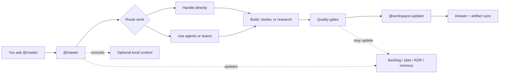

# claude-team-kit — Starter Tier

[](https://github.com/Konstantinos-Sakellariou/claude-team-kit/actions/workflows/validate.yml)


**This is the Starter tier of [Launch Foundry](https://launchfoundry.co) — free, fully functional, and ready to install.**

A drop-in AI team workspace for Claude Code. Copy it into your repo, run setup, and your AI team is live in under 5 minutes. Every request goes through `@master`, which routes to 15 specialized agents across engineering, product, and design.

**Want the full system?** The Pro tier includes 61 agents, 17 teams, all rules and hooks, and a configured expansion pack matched to your business type. [See what's included →](https://launchfoundry.co/pricing)

**Every request goes through `@master`. Always.**

## What's In This Tier

| Layer | Starter |
|---|---|
| `@master` | Orchestrator — routes all work, selects agents, reports back |
| Agents | 15 core agents: senior-developer, architect, product-owner, qa-engineer, security-auditor, debugger, researcher, tech-writer, business-analyst, content-writer, project-manager, brand-designer, product-designer, workspace-updater |
| Teams | 2 teams: Engineering Team, Product Team |
| Rules | 5 foundational rules: code-quality, documentation-governance, context-efficiency, security, git-workflow |
| Hooks | 3 hooks: block-secrets, auto-format, warn-doc-drift |
| Commands | 6 commands: bootstrap-repo, customize-repo, plan-idea, save-backlog, write-adr, triage-input |
| Skills | 8 skills: fix-bug, implement-feature, write-docs, git-commit, explain-code, write-tests, security-audit, repo-cleanup |
| Durable memory | Backlog, ADRs, local context, handoff surfaces |
| Validation | `./scripts/setup.sh`, `./scripts/doctor.sh`, tests |

## Quick Start

### 1. Copy the kit into your repo

Use this repository as a template or copy the tracked kit files into a project that should use the workspace system.

The most important files and folders are:
- `.claude/`
- `CLAUDE.md`
- `AGENTS.md`
- `README.md`
- `docs/`
- `scripts/`
- `.mcp.json`
- `.env.example`

### 2. Run setup and validation

```bash
./scripts/setup.sh
./scripts/doctor.sh
python3 -m unittest discover -s tests -v
```

Expected result:
- `doctor.sh` should finish without errors
- local warnings about missing `.env` or `.claude/settings.local.json` are normal before local setup
- the Python test suite should pass

### 3. Start with `@master`

Good first prompts:
- `@master help me bootstrap this repo for a SaaS app`
- `@master customize this repo for the actual product we are building`
- `@master help me decide what we should build first`
- `@master review this repo and tell me the best next 3 moves`

If the copied repo still looks generic, `@master` should use a guided initialization style: it asks small high-signal questions, accepts partial answers, labels temporary assumptions, and helps decide what should go into tracked docs versus `.claude/local-context/`.

If the repo is already customized but still vague, use `/customize-repo` or ask `@master` for a customization pass. Once the direction is chosen, `@master` should suggest or run `/plan-idea` when a structured rollout would help.

## Core Mental Model

You talk to `@master`; `@master` decides the team, agents, gates, and artifact updates.



By default, `@master` also reports which teams and agents were selected, what each one did, and the outcome. If no delegation was needed, `@master` should say that explicitly.

## Common Workflows

| Need | Start here |
|---|---|
| Initialize a copied repo | Ask `@master` to bootstrap it, or use `/bootstrap-repo`; see [docs/BOOTSTRAP.md](docs/BOOTSTRAP.md) |
| Make a generic repo specific | Use `/customize-repo`; see [docs/PROJECT_CUSTOMIZATION.md](docs/PROJECT_CUSTOMIZATION.md) |
| Save deferred work | Use `/save-backlog`; private `BACKLOG.md` is the default local registry |
| Shape a substantial idea | Use `/plan-idea`; approving a plan is not the same as approving a tracked public plan |
| Record a durable decision | Use `/write-adr`; `@master` should propose an ADR by default for durable decisions |
| Triage a noisy input | Use `/triage-input`; the default large-input workflow is classify, sample, summarize, then route narrowly |

Starter commands:
- `/bootstrap-repo`
- `/customize-repo`
- `/plan-idea`
- `/save-backlog`
- `/write-adr`
- `/triage-input`

These command definitions live in `.claude/commands/`. Commands do not bypass `@master`; they make repeatable workflows easier to trigger.

> **Want more commands?** Pro adds `/envision`, `/create-pr`, `/sprint-plan`, `/generate-changelog`, `/security-review`, and more. [See Pro →](https://launchfoundry.co/pricing)

## Repo Structure

```text
.claude/
├── agents/          15 specialized agents
├── teams/           2 reusable team manifests
├── skills/          8 reusable skills
├── rules/           5 foundational rules
├── hooks/           3 shell hooks (secrets, format, drift)
└── local-context/   Optional local-only business, customer, and strategy context
docs/                Architecture, governance, and workflow docs
scripts/             Setup and validation helpers
tests/               Prompt-contract, hook, and doctor tests
CLAUDE.md            Main Claude-compatible project briefing
AGENTS.md            Compatibility briefing for tools that consume AGENTS.md
BACKLOG.example.md   Starter for private local backlog work
```

## Available Teams

Teams are reusable orchestration bundles. `@master` activates them for recurring workflows and reports which agents actually ran.

| Team | Lead | Typical Use |
|---|---|---|
| `Engineering Team` | `@senior-developer` or `@architect` | features, debugging, architecture, code review |
| `Product Team` | `@product-owner` or `@product-designer` | requirements, UX flows, scope decisions, product docs |

The canonical team definitions live in `.claude/teams/`.

> **Pro includes 17 teams** — AI/ML, Data, Supabase, Design, Content & Publishing, Git / GitHub, Advisory Review, and more. [See Pro →](https://launchfoundry.co/pricing)

## Private Local Context

Use `.claude/local-context/` for sensitive local-only startup, customer, company, or strategy notes. `@master` may consult it when relevant, but it should never copy private local-context details into tracked docs automatically.

Useful local surfaces:
- `.claude/local-context/HANDOFF.md` for compact session continuity
- `.claude/local-context/FEEDBACK.md` for objective local workflow feedback and root-cause notes
- `.claude/local-context/research/` for local-first repo reviews and tool evaluations
- `.claude/local-context/estimation-log.md` for real estimate-versus-actual learning
- `.claude/local-context/plans/` for private planning artifacts
- private `BACKLOG.md` for local deferred work

See [docs/LOCAL_CONTEXT.md](docs/LOCAL_CONTEXT.md) and [docs/DURABLE_MEMORY.md](docs/DURABLE_MEMORY.md).

## New Repo Bootstrap

When `claude-team-kit` is copied into a repo other than itself, `@master` should check whether `CLAUDE.md`, `AGENTS.md`, and `README.md` still look generic before major work begins.

If they do, `@master` should switch into guided initialization style:
- ask in small rounds
- accept partial answers
- offer candidate categories when the user is unsure
- make labeled temporary assumptions when needed
- separate safe tracked repo truth from private local context

See [docs/BOOTSTRAP.md](docs/BOOTSTRAP.md) and [docs/PROJECT_CUSTOMIZATION.md](docs/PROJECT_CUSTOMIZATION.md).

## Context Efficiency

The default guidance:
- read narrow first
- keep always-loaded briefings concise
- use focused docs for depth
- triage large logs, diffs, and dumps before analysis
- prefer specialist-first routing for noisy tasks when the right owner is clear

See [docs/CONTEXT_EFFICIENCY.md](docs/CONTEXT_EFFICIENCY.md) and [docs/RTK_INTEGRATION.md](docs/RTK_INTEGRATION.md).

## Docs Reference

| Topic | Doc |
|---|---|
| Architecture boundary | [docs/ARCHITECTURE.md](docs/ARCHITECTURE.md) |
| Documentation governance | [docs/DOCUMENTATION_GOVERNANCE.md](docs/DOCUMENTATION_GOVERNANCE.md) |
| Durable memory | [docs/DURABLE_MEMORY.md](docs/DURABLE_MEMORY.md) |
| Bootstrap flow | [docs/BOOTSTRAP.md](docs/BOOTSTRAP.md) |
| Context efficiency | [docs/CONTEXT_EFFICIENCY.md](docs/CONTEXT_EFFICIENCY.md) |
| Local context layer | [docs/LOCAL_CONTEXT.md](docs/LOCAL_CONTEXT.md) |
| Project customization | [docs/PROJECT_CUSTOMIZATION.md](docs/PROJECT_CUSTOMIZATION.md) |
| Artifacts companion layer | [docs/ARTIFACTS.md](docs/ARTIFACTS.md) |
| Research workflow | [docs/RESEARCH_AND_DISCOVERY.md](docs/RESEARCH_AND_DISCOVERY.md) |
| Feedback loop | [docs/FEEDBACK_AND_LEARNING.md](docs/FEEDBACK_AND_LEARNING.md) |
| RTK integration | [docs/RTK_INTEGRATION.md](docs/RTK_INTEGRATION.md) |
| Vision template | [docs/VISION.example.md](docs/VISION.example.md) |
| Roadmap template | [docs/ROADMAP.example.md](docs/ROADMAP.example.md) |

## Roadmap And Backlog

Use the vision and roadmap templates to give `@master` strategic context:
- [docs/VISION.example.md](docs/VISION.example.md) shows the template for direction
- [docs/ROADMAP.example.md](docs/ROADMAP.example.md) shows the template for phased sequencing
- local `docs/VISION.md` and `docs/ROADMAP.md` hold your actual private direction
- private `BACKLOG.md` captures local deferred work (start from `BACKLOG.example.md`)

If backlog preference is unknown, `@master` should ask whether to use private local `BACKLOG.md` or tracked public `docs/BACKLOG.md`.

## How To Ask Well

High-signal requests make the system cheaper and better. Best inputs usually include:
- exact file paths
- exact errors or failing commands
- expected outcome
- relevant constraints, such as "docs only" or "do not change behavior"

Examples:
- `@master update README.md to explain the new setup flow`
- `@master fix the failing doctor check in scripts/doctor.sh`
- `@master review the auth changes and focus on security regressions`

Broad requests are fine, but `@master` should narrow them before doing a large sweep.

## Maintainer Notes

When changing agents, teams, commands, skills, rules, hooks, artifact policy, or workflow behavior:
- update the canonical implementation in `.claude/`
- keep `README.md`, `CLAUDE.md`, and `AGENTS.md` aligned when the public operating model changes
- keep the hot path lean and move depth into focused docs
- run `./scripts/setup.sh` and `./scripts/doctor.sh`
- run `python3 -m unittest discover -s tests -v`

The repo includes a doc-drift warning hook and a block-secrets hook to keep core docs and artifact placement honest.

See [docs/DOCUMENTATION_GOVERNANCE.md](docs/DOCUMENTATION_GOVERNANCE.md) before major upgrades.
