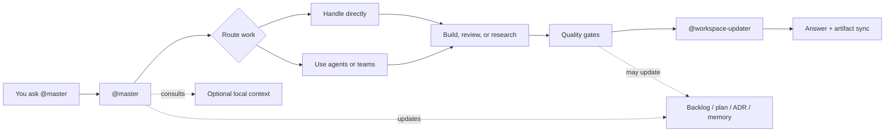

# claude-team-kit

[](https://github.com/Konstantinos-Sakellariou/claude-team-kit/actions/workflows/validate.yml)


A drop-in workspace kit for Claude-style coding tools. It gives a repo an orchestrated AI team through `@master`, 53 specialized agents, 13 reusable team manifests, 20 reusable skills, rules, hooks, memory, and local context.

The goal is simple: copy the kit into a real project, run the setup checks, then start working through one visible orchestrator.

**Every request goes through `@master`. Always.**

## Who This Is For

`claude-team-kit` is for:
- solo builders who want a serious AI coding workspace
- startup founders and early teams turning rough repos into guided product workspaces
- agencies, consultants, and platform teams who reuse agent/rule infrastructure across projects
- maintainers who want quality gates, durable memory, and public/private context boundaries from day one

It is a workspace kit, not a background orchestration runtime. The canonical implementation lives in `.claude/`, and the docs explain how to adapt it safely.

## What You Get

| Layer | What it gives you |
|---|---|
| `@master` | One entrypoint that scopes work, selects teams/agents, reports what happened, and triggers the final doc-impact gate |
| Agents | 53 specialized agents across engineering, AI/ML, data, design, content, delivery, advisory, Git/GitHub, and product workflows |
| Teams | 13 reusable team manifests for recurring collaboration patterns |
| Skills | 20 reusable skills, including `code-review`, `fix-bug`, `write-tests`, `write-docs`, `security-audit`, `context-audit`, `triage-input`, and `repo-cleanup` |
| Rules and hooks | Documentation governance, artifact safety, context efficiency, GitHub quality gates, release governance, security, testing, and language rules |
| Durable artifacts | Backlog, plans, ADRs, local context, handoff, and memory surfaces with public/private boundaries |
| Validation | `./scripts/setup.sh`, `./scripts/doctor.sh`, and `python3 -m unittest discover -s tests -v` |

## Quick Start

### 1. Copy the kit into your repo

Use this repository as a template or copy the tracked kit files into a project that should use the workspace system.

The most important files and folders are:
- `.claude/`
- `CLAUDE.md`
- `AGENTS.md`
- `README.md`
- `docs/`
- `scripts/`
- `.mcp.json`
- `.env.example`

### 2. Run setup and validation

```bash
./scripts/setup.sh
./scripts/doctor.sh
python3 -m unittest discover -s tests -v
```

Expected result:
- `doctor.sh` should finish without errors
- local warnings about missing `.env` or `.claude/settings.local.json` are normal before local setup
- the Python test suite should pass

### 3. Start with `@master`

Good first prompts:
- `@master help me bootstrap this repo for a SaaS app`
- `@master customize this repo for the actual product we are building`
- `@master turn this into a Supabase product workspace`
- `@master review this repo and tell me the best next 3 moves`

If the copied repo still looks generic, `@master` should use a guided initialization style: it asks small high-signal questions, accepts partial answers, labels temporary assumptions, and helps decide what should go into tracked docs versus `.claude/local-context/`.

If the repo is already customized but still vague, use `/customize-repo` or ask `@master` for a customization pass.

## Core Mental Model

You talk to `@master`; `@master` decides the team, agents, gates, and artifact updates.



By default, `@master` also reports which teams and agents were selected, what each one did, and the outcome. If no delegation was needed, `@master` should say that explicitly.

For all tasks, `@master` should at least report:
- whether delegation happened
- which teams or agents ran, or that `@master` handled it alone
- what happened
- what comes next

For significant work, the report should also make clear:
- which team was primary, if a team was used
- who led that team
- why that team was activated

Teams are reusable orchestration bundles that `@master` can activate for recurring workflows. They are routing manifests, not a runtime engine.

## Common Workflows

| Need | Start here |
|---|---|
| Initialize a copied repo | Ask `@master` to bootstrap it, or use `/bootstrap-repo`; see [docs/BOOTSTRAP.md](docs/BOOTSTRAP.md) |
| Make a generic repo specific | Use `/customize-repo`; see [docs/PROJECT_CUSTOMIZATION.md](docs/PROJECT_CUSTOMIZATION.md) |
| Save deferred work | Use `/save-backlog`; private `BACKLOG.md` is the default local registry |
| Shape a substantial idea | Use `/plan-idea`; approving a plan is not the same as approving a tracked public plan |
| Record a durable decision | Use `/write-adr`; `@master` should propose an ADR by default for durable architecture, policy, workflow, or repo-structure decisions |
| Check release or PR readiness | Use `/release-check`; see [docs/RELEASE_GOVERNANCE.md](docs/RELEASE_GOVERNANCE.md) |
| Sync core docs after changes | Use `/sync-docs`; `@workspace-updater` is the adaptive doc-impact gate |
| Triage a noisy input | Use `/triage-input`; the default large-input workflow is classify, sample, summarize, then route narrowly |
| Audit context quality | Use `/context-audit`; use `repo-cleanup` after this kit is copied into a real repo |
| Review an external reference | Use `/review-reference`; save durable repo/tool/image reviews locally under `.claude/local-context/research/` |

Current command set:
- `/bootstrap-repo`
- `/customize-repo`
- `/save-backlog`
- `/plan-idea`
- `/write-adr`
- `/release-check`
- `/sync-docs`
- `/triage-input`
- `/context-audit`
- `/review-reference`

These command definitions live in `.claude/commands/`. Commands do not bypass `@master`; they make repeatable workflows easier to trigger.

## Workflow Commands

The command layer is a thin set of named workflow entrypoints on top of `@master`, teams, agents, and skills. Use commands when you want a repeatable path; use plain `@master` requests when you want a more conversational route.

## Repo Structure

```text
.claude/
├── agents/          53 specialized agents
├── teams/           13 reusable team manifests
├── skills/          20 reusable skills
├── rules/           Modular behavior and governance rules
├── hooks/           Shell checks for formatting, secrets, drift, artifacts, and safety
├── agent-memory/    Persistent per-agent memory
└── local-context/   Optional local-only business, customer, and strategy context
docs/                Focused docs, packs, workflows, examples, and architecture notes
scripts/             Setup and validation helpers
tests/               Prompt-contract, hook, and doctor tests
CLAUDE.md            Main Claude-compatible project briefing
AGENTS.md            Compatibility briefing for tools that consume AGENTS.md
BACKLOG.example.md   Starter for private local backlog work
```

The full feature and connection map lives in [docs/SYSTEM_REFERENCE.md](docs/SYSTEM_REFERENCE.md).

## What Teams Mean

Teams are reusable orchestration bundles. They keep recurring flows consistent while `@master` still reports the actual agents selected and the final synthesized outcome.

## Available Teams

| Team | Typical Use |
|---|---|
| `Engineering Team` | implementation, debugging, architecture, engineering review |
| `AI/ML Team` | model framing, training, evaluation, rollout readiness |
| `Data Team` | pipelines, warehouse modeling, analytics, experimentation, data governance |
| `Supabase Team` | auth, schema, migrations, RLS, storage, edge functions, rollout safety |
| `Design Team` | product UX, UI layout, design-system consistency, brand-sensitive presentation work |
| `Executive Team` | executive/org-model architecture, company-operating structure, and public/private operating-boundary work |
| `Content & Publishing Team` | planning, drafting, editorial review, source-backed publishing |
| `Delivery & Ops Team` | release, delivery, monitoring, privacy, backlog persistence |
| `Git / GitHub Team` | commit, push, PR, release readiness, branch hygiene, repo-safety review |
| `Advisory Review Team` | planning, prioritization, strategy, business, and next-move support |
| `Product Discovery Team` | early app/website/product shaping, MVP reduction, backlog/roadmap framing |
| `Product Launch Team` | cross-functional website/app launch coordination from build through ship |
| `Research & Discovery Team` | external repo/tool/image reviews, ecosystem scans, and source-backed fit evaluation |

The canonical team definitions live in `.claude/teams/`. See [docs/TEAMS.md](docs/TEAMS.md), [docs/AGENT_WORKFLOWS.md](docs/AGENT_WORKFLOWS.md), [docs/SUPABASE_REFERENCE.md](docs/SUPABASE_REFERENCE.md), [docs/DATA_REFERENCE.md](docs/DATA_REFERENCE.md), and [docs/DESIGN_REFERENCE.md](docs/DESIGN_REFERENCE.md).

## Private Local Context

Use `.claude/local-context/` for sensitive local-only startup, customer, company, proof-of-concept, or strategy notes. `@master` may consult it when relevant, but it should never copy private local-context details into tracked docs automatically.

Useful local surfaces:
- `.claude/local-context/HANDOFF.md` for compact session continuity
- `.claude/local-context/ACTIVITY.md` for an optional compact trace of significant orchestration sessions
- `.claude/local-context/research/` for local-first repo reviews, tool evaluations, and image/reference memos
- `.claude/local-context/estimation-log.md` for real estimate-versus-actual learning
- `.claude/local-context/plans/` for private planning artifacts
- private `BACKLOG.md` for local deferred work

If backlog preference is known, `@master` and `@backlog-updater` should reuse it unless the user overrides it. If it is unknown, `@master` should ask whether backlog capture belongs in private local `BACKLOG.md` or tracked public `docs/BACKLOG.md`.

See [docs/LOCAL_CONTEXT.md](docs/LOCAL_CONTEXT.md), [docs/DURABLE_MEMORY.md](docs/DURABLE_MEMORY.md), [docs/PROJECT_DNA_AND_STATE.md](docs/PROJECT_DNA_AND_STATE.md), and [docs/RESEARCH_AND_DISCOVERY.md](docs/RESEARCH_AND_DISCOVERY.md).

## New Repo Bootstrap

When `claude-team-kit` is copied into a repo other than itself, `@master` should check whether `CLAUDE.md`, `AGENTS.md`, and `README.md` still look generic before major work begins.

If they do, `@master` should switch into guided initialization style:
- ask in small rounds
- accept partial answers
- offer candidate categories when the user is unsure
- make labeled temporary assumptions when needed
- separate safe tracked repo truth from private local context

When product, customer, or operating-model shaping is part of setup, bootstrap can expand into company-building workflow mode. The private local context layer helps keep sensitive company, customer, and strategy notes out of tracked docs by default.

For repos that are no longer generic but still not specific enough, move from bootstrap into customization. See [docs/BOOTSTRAP.md](docs/BOOTSTRAP.md), [docs/PROJECT_CUSTOMIZATION.md](docs/PROJECT_CUSTOMIZATION.md), and [docs/IDEA_TO_PRODUCTION.md](docs/IDEA_TO_PRODUCTION.md).

## Context Efficiency

This kit should stay efficient as well as capable.

The default guidance:
- read narrow first
- keep always-loaded briefings concise
- use focused docs for depth
- triage large logs, diffs, and dumps before analysis
- prefer specialist-first routing for noisy tasks when the right owner is clear
- keep model routing intentional

The kit has an explicit model-routing stance:
- `Haiku` for cheap summarization and repetitive low-risk condensation
- `Sonnet` as the default for most implementation and docs work
- `Opus` for architecture, contested decisions, deep debugging, and other genuinely heavy reasoning tasks

Low-risk cheaper-by-default agents now include:
- `@backlog-curator`
- `@changelog-writer`
- `@feedback-synthesizer`
- `@delivery-monitor`

See [docs/CONTEXT_EFFICIENCY.md](docs/CONTEXT_EFFICIENCY.md) and [docs/RTK_INTEGRATION.md](docs/RTK_INTEGRATION.md).

## Quality Gates

GitHub-bound work should use the visible GitHub Quality Gate. Before code-affecting commit, push, or PR packaging, `@master` should route through the Git / GitHub Team and surface the safety report for the user to approve.

The gate covers:
- sync-readiness and branch hygiene, including a quick sync check or pull when the branch may be stale
- `@github-safety-guard`
- `@code-reviewer`
- `@qa-engineer`
- `@pr-operator`
- `@production-readiness-reviewer` when risk warrants it

This kit also includes a stricter release-governance layer for release-heavy paths. Release-heavy paths should end in a visible `READY`, `READY WITH NOTED RISK`, or `NOT READY` summary.

See [.claude/rules/github-quality-gate.md](.claude/rules/github-quality-gate.md), [.claude/rules/release-governance.md](.claude/rules/release-governance.md), [docs/RELEASE_GOVERNANCE.md](docs/RELEASE_GOVERNANCE.md), and [docs/TEAMS.md](docs/TEAMS.md).

## Starter, Solution, And Design Packs

Packs are optional adaptation layers. They help a copied repo start faster without turning the shared core into one universal app template.

| Pack Type | Use It For | Docs |
|---|---|---|
| Starter packs | Repo-shape overlays such as SaaS, API service, AI/ML product, or startup studio | [docs/STARTER_PACKS.md](docs/STARTER_PACKS.md) |
| Solution packs | Stack foundations such as Supabase, GitHub/CI/CD, and Vercel | [docs/SOLUTION_PACKS.md](docs/SOLUTION_PACKS.md) |
| Design packs | Visual, brand, and design-system foundations | [docs/DESIGN_PACKS.md](docs/DESIGN_PACKS.md) |

Current solution packs:
- [Supabase Application Foundation](docs/solution-packs/supabase-foundation.md)
- [GitHub And CI/CD Foundation](docs/solution-packs/github-cicd-foundation.md)
- [Vercel Deployment Foundation](docs/solution-packs/vercel-foundation.md)

Current design-pack library:
- [Clean SaaS Product](docs/design-packs/clean-saas.md)
- [Startup Studio / Founder Service](docs/design-packs/startup-studio.md)
- [Premium Service / Advisory](docs/design-packs/premium-service.md)
- [Technical Console / Dashboard](docs/design-packs/technical-console.md)

## Advanced Docs

The README is the front door. Use these docs when you need the deeper model.

| Topic | Start Here |
|---|---|
| One-pass explanation | [docs/ONE_PAGER.md](docs/ONE_PAGER.md) |
| Research workflow | [docs/RESEARCH_AND_DISCOVERY.md](docs/RESEARCH_AND_DISCOVERY.md) |
| Full feature inventory | [docs/SYSTEM_REFERENCE.md](docs/SYSTEM_REFERENCE.md) |
| Architecture boundary | [docs/ARCHITECTURE.md](docs/ARCHITECTURE.md) |
| Documentation governance | [docs/DOCUMENTATION_GOVERNANCE.md](docs/DOCUMENTATION_GOVERNANCE.md) |
| Durable memory | [docs/DURABLE_MEMORY.md](docs/DURABLE_MEMORY.md) |
| Graph/repo intelligence | [docs/GRAPH_INTELLIGENCE.md](docs/GRAPH_INTELLIGENCE.md) |
| Code-intelligence integration | [docs/CODE_INTELLIGENCE_INTEGRATION.md](docs/CODE_INTELLIGENCE_INTEGRATION.md) |
| Code-review-graph adapter example | [docs/CODE_REVIEW_GRAPH_ADAPTER_EXAMPLE.md](docs/CODE_REVIEW_GRAPH_ADAPTER_EXAMPLE.md) |
| Optional dependencies and adapters | [docs/OPTIONAL_DEPENDENCIES_AND_ADAPTERS.md](docs/OPTIONAL_DEPENDENCIES_AND_ADAPTERS.md) |
| External skill repos | [docs/EXTERNAL_SKILL_REPOS.md](docs/EXTERNAL_SKILL_REPOS.md) |
| Cross-tool portability | [docs/CROSS_TOOL_PORTABILITY.md](docs/CROSS_TOOL_PORTABILITY.md) |
| Portability and intelligence overview | [docs/PORTABILITY_AND_INTELLIGENCE_OVERVIEW.md](docs/PORTABILITY_AND_INTELLIGENCE_OVERVIEW.md) |
| App surface and MCP systems | [docs/APP_SURFACE_AND_MCP.md](docs/APP_SURFACE_AND_MCP.md) |
| Artifacts companion layer | [docs/ARTIFACTS.md](docs/ARTIFACTS.md) |
| Agent SDK user input | [docs/AGENT_SDK_USER_INPUT.md](docs/AGENT_SDK_USER_INPUT.md) |
| Project DNA and state | [docs/PROJECT_DNA_AND_STATE.md](docs/PROJECT_DNA_AND_STATE.md) |
| Playbooks and batch workflows | [docs/PLAYBOOKS_AND_BATCH_WORKFLOWS.md](docs/PLAYBOOKS_AND_BATCH_WORKFLOWS.md) |
| Annotation-aware context protocol | [docs/ANNOTATION_AWARE_CONTEXT_PROTOCOL.md](docs/ANNOTATION_AWARE_CONTEXT_PROTOCOL.md) |
| Worktree parallel execution | [docs/WORKTREE_PARALLEL_EXECUTION.md](docs/WORKTREE_PARALLEL_EXECUTION.md) |
| Roadmap template | [docs/ROADMAP.example.md](docs/ROADMAP.example.md) |
| Vision template | [docs/VISION.example.md](docs/VISION.example.md) |
| Self-upgrade guide | [docs/SELF_UPGRADE.md](docs/SELF_UPGRADE.md) |

Key distinction: graph/repo intelligence = artifact relationships. Code intelligence = code-aware search, symbols, dependencies, and retrieval. Both are optional by design.

## Roadmap And Backlog

Use the vision and roadmap together:
- [docs/VISION.example.md](docs/VISION.example.md) shows the public template for direction
- local `docs/VISION.md` may hold the actual repo direction when it is safe to keep locally
- [docs/ROADMAP.example.md](docs/ROADMAP.example.md) shows the public template for phased sequencing
- local `docs/ROADMAP.md` may hold private real sequencing
- private `BACKLOG.md` captures local deferred work
- optional tracked `docs/BACKLOG.md` captures public backlog history

For capacity and sequencing, use `@session-budget-estimator` in `Session Mode`, `Roadmap Mode`, or `Hybrid Mode`.

For strategic fit, use `@strategy-reviewer`, which should classify major additions as `Strong fit`, `Moderate fit`, `Weak fit`, or `Misaligned`.

For collaborative next-move generation, use `@vision-partner` to connect vision, roadmap, and backlog into grounded options.

## How To Ask Well

High-signal requests make the system cheaper and better. Best inputs usually include:
- exact file paths
- exact errors or failing commands
- expected outcome
- relevant constraints, such as "docs only" or "do not change behavior"

Examples:
- `@master update README.md to explain the new setup flow`
- `@master fix the failing doctor check in scripts/doctor.sh`
- `@master review the auth changes and focus on security regressions`

Broad requests are fine, but `@master` should narrow them before doing a large sweep.

## Maintainer Notes

When changing agents, teams, commands, skills, rules, hooks, artifact policy, or workflow behavior:
- update the canonical implementation in `.claude/`
- keep `README.md`, `CLAUDE.md`, and `AGENTS.md` aligned when the public operating model changes
- keep the hot path lean and move depth into focused docs
- run `./scripts/doctor.sh`
- run `python3 -m unittest discover -s tests -v`

The repo includes a doc-drift warning hook and tracked-artifact warning shell hooks to keep core docs and artifact placement honest.

Use [docs/SELF_UPGRADE.md](docs/SELF_UPGRADE.md) and [docs/DOCUMENTATION_GOVERNANCE.md](docs/DOCUMENTATION_GOVERNANCE.md) before major upgrades.
