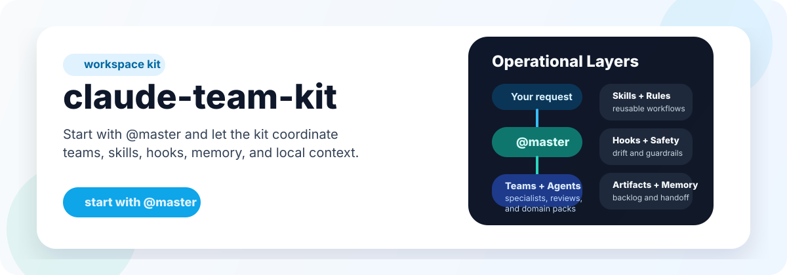
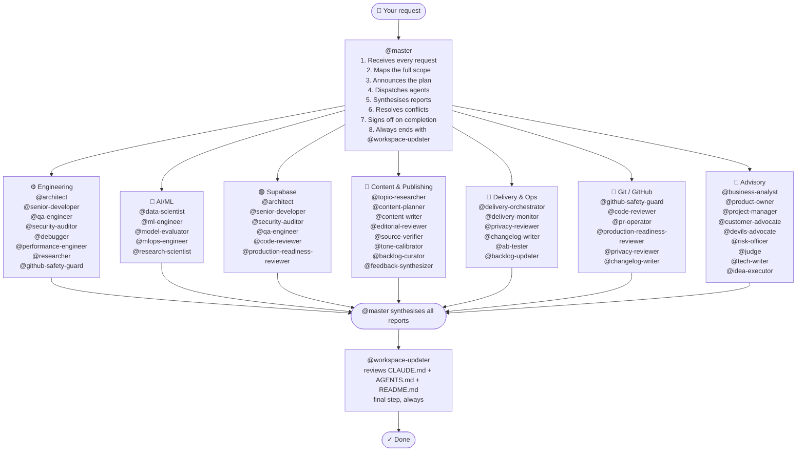

# claude-team-kit

[](https://github.com/Konstantinos-Sakellariou/claude-team-kit/actions/workflows/validate.yml)




A production-ready workspace kit for Claude-style coding tools. It gives any repo a professional AI team through agent prompts, skills, rules, hooks, and persistent memory.

This repo is a team-definition layer, not a standalone orchestration runtime. It focuses on reusable workspace structure and operating conventions rather than tmux workers, background daemons, or execution HUDs.

This kit supports a local vision and roadmap model.
Use [`docs/VISION.example.md`](docs/VISION.example.md) and [`docs/ROADMAP.example.md`](docs/ROADMAP.example.md) as tracked starters, and keep real `docs/VISION.md` / `docs/ROADMAP.md` local when they contain private strategy or sequencing.

## What's Inside

```text
.claude/
├── agents/          41 specialized agents across engineering, AI/ML, content, delivery, and advisory
├── teams/           7 reusable team manifests that @master can activate for recurring workflows
├── skills/          20 reusable skills (code-review, fix-bug, business-case, create-pr, context-audit, triage-input, repo-cleanup...)
├── rules/           Modular rule files — docs, artifacts, context, Python, TypeScript, security, testing, git, performance, API design, AI/ML workflow
├── hooks/           Shell automations (auto-format, secret detection, file protection, doc-drift warning...)
├── agent-memory/    Persistent per-agent memory (grows over time)
└── local-context/   Optional local-only business, customer, and strategy context
BACKLOG.example.md   Starter for the private local backlog file
docs/BACKLOG.example.md
                    Starter for an optional tracked public backlog
docs/DOCUMENTATION_GOVERNANCE.md
                    Anti-bloat documentation policy
docs/ROADMAP.example.md
                    Starter for a local repo-specific roadmap
docs/SELF_UPGRADE.md
                    Maintainer guide for evolving the kit safely
docs/STARTER_PACKS.md
                    Optional project-shape overlays for faster repo customization
docs/SYSTEM_REFERENCE.md
                    Full feature inventory and connection map
docs/VISION.example.md
                    Starter for a local repo-specific vision brief
CLAUDE.md            Master project briefing — customize per project
AGENTS.md            Compatibility briefing for tools that read AGENTS.md
.mcp.json            MCP server config (GitHub pre-configured)
docs/                Workflow and architecture documentation
scripts/             Setup and validation helpers
.env.example         Optional local environment template
```

## Context Efficiency

This kit should stay efficient as well as capable.

That means:
- keep always-loaded briefing files high-signal
- prefer narrow reads before broad repo sweeps
- triage large logs, diffs, and dumps before handing raw output to the model
- prefer durable artifacts over repeating long chat recaps
- use only the tools and MCP servers the task actually needs

See [`docs/CONTEXT_EFFICIENCY.md`](docs/CONTEXT_EFFICIENCY.md) for the full guidance, including request-shaping, large-input triage, and optional RTK usage.

## GitHub Quality Gate

This kit now treats GitHub-bound code as a high-standard surface.

For code-affecting commit, push, and PR flows, the default expectation is:
- safety review
- code review
- test adequacy review
- production-readiness review when the change is risky enough

See [`@.claude/rules/github-quality-gate.md`](.claude/rules/github-quality-gate.md) for the canonical gate.

Two repo-native skills now support this directly:
- `context-audit` for auditing briefing quality, doc drift, and artifact placement
- `triage-input` for compressing noisy logs, diffs, dumps, and large evidence into a smaller next step

## Release Governance

This kit also includes a stricter release-governance layer for release-heavy or merge-critical work.

That flow strengthens the Git / GitHub team with:
- safety review
- privacy review
- code and QA gates
- production-readiness review
- changelog / release-note coverage
- final risk sign-off

See [`docs/RELEASE_GOVERNANCE.md`](docs/RELEASE_GOVERNANCE.md) for the full model.

## How To Ask Well

High-signal requests make the system both cheaper and better.

Best inputs usually include:
- exact file paths when you know them
- exact errors or failing commands when you have them
- what outcome you want
- any constraints, such as "do not change behavior" or "docs only"

Examples:
- "Update [`README.md`](README.md) to explain the new setup flow."
- "Fix the failing doctor check in [`scripts/doctor.sh`](scripts/doctor.sh)."
- "Review the auth changes in `src/auth.ts` and focus on security regressions."

Lower-signal requests are still okay, but they usually cost more context:
- "scan the whole repo"
- "fix bugs everywhere"
- "read this huge log and tell me what happened" without narrowing

If your request starts broad, `@master` should help narrow it before doing a large sweep.

## Quick Start

1. Use this repo as a template or copy it into your project root
2. Run `./scripts/setup.sh`
3. Fill in `.claude/settings.local.json` and/or `.env` with your `GITHUB_TOKEN`
4. Use the generated local `BACKLOG.md` for private planning and deferred work, or create `docs/BACKLOG.md` from `docs/BACKLOG.example.md` if you want a public tracked backlog
5. Add any sensitive startup, customer, or strategy notes to `.claude/local-context/` and keep that folder local-only
6. Edit `CLAUDE.md` for the target project you want the kit to describe
7. Run `./scripts/doctor.sh`
8. Run a cleanup pass once the repo is clearly customized enough to prune generic leftovers
9. Start a Claude session and address `@master`

## Vision Alignment

This repo now has an explicit direction.

When adding backlog items, plans, agents, teams, rules, hooks, or skills, we should ask:
- does this strengthen the reusable workspace kit?
- does it move the repo toward a stronger digital-product or digital-company operating model?
- does it belong in the core, or only in a plan/customization layer?

Use [`docs/VISION.example.md`](docs/VISION.example.md) as the public model for how a vision doc should work, and use local `docs/VISION.md` as the actual filter when a repo has one.

Use [`docs/DOCUMENTATION_GOVERNANCE.md`](docs/DOCUMENTATION_GOVERNANCE.md) to keep the core briefings lean while the repo grows, and [`docs/SYSTEM_REFERENCE.md`](docs/SYSTEM_REFERENCE.md) when you need the full feature map instead of a hot-path summary.

## Self-Upgrade

This kit should be able to evolve itself without drifting or re-bloating.

Use [`docs/SELF_UPGRADE.md`](docs/SELF_UPGRADE.md) when changing agents, teams, commands, skills, rules, hooks, artifact policy, or core workflow behavior.

The short version is:
- update the canonical implementation in `.claude/`
- update only the right summary docs and focused docs
- keep public vs local boundaries clean
- run doctor and tests before calling the upgrade done

## Roadmap And Backlog

This kit now treats roadmap and backlog as separate but connected surfaces:

- [`docs/ROADMAP.example.md`](docs/ROADMAP.example.md) shows the roadmap structure the kit expects
- local `docs/ROADMAP.md` is where a repo can keep its real phased priorities if they should stay private
- `BACKLOG.md` is the local private registry of future work and follow-ups
- `docs/BACKLOG.md` is the optional tracked public backlog for repos that want visible backlog history

Use the roadmap to decide sequence and milestone fit.
Use the backlog to capture concrete items and deferred work.

## Starter Packs

This kit now includes optional starter packs for common repo shapes.

Use [`docs/STARTER_PACKS.md`](docs/STARTER_PACKS.md) when a copied repo clearly behaves like a:
- SaaS app
- API service
- AI/ML product
- startup studio

The packs are not part of the runtime model.
They are adaptation overlays that help bootstrap and customization converge faster.

## What This Repo Is

- A reusable workspace kit for agent-based development
- A curated team of 41 agents with explicit collaboration patterns
- A prompt and guardrail layer that can be dropped into another project

## What This Repo Is Not

- A standalone orchestration daemon
- A CLI worker runtime
- A token analytics platform
- A replacement for execution engines such as OMC

---

## How Orchestration Works

**Every request goes through `@master`. Always.**

You never call specialist agents directly. You talk to `@master`, and it decides who runs, in what order, and whether things happen in parallel or sequentially — then synthesises everything back into one coherent response.

Even if a user does not explicitly mention `@master`, or names a specialist directly, `@master` remains the first and only orchestrator in the main thread.

By default, `@master` also reports which teams and agents were selected, what each one did, and the outcome of the orchestration run. If no delegation was needed, `@master` should say that explicitly instead of silently skipping the report.



**The orchestration loop — what `@master` does on every request:**

```
RECEIVE → ANALYSE scope → PLAN pipeline → ANNOUNCE plan to user
  → DISPATCH agents (parallel where independent, sequential where dependent)
  → COLLECT all reports → SYNTHESISE findings → RESOLVE conflicts
  → DECIDE: more work needed? → loop | user decision needed? → surface it | done? → sign off
  → TRIGGER @workspace-updater → COMPLETE
```

`@workspace-updater` runs automatically as the last step after significant work. It reviews the core docs (`CLAUDE.md`, `AGENTS.md`, and `README.md`) even when no edits are ultimately required.

## New Repo Bootstrap

When this kit is copied into a repo other than `claude-team-kit`, `@master` should check whether the project briefing still looks generic before major work starts.

If the repo docs still look template-like, `@master` should pause briefly, ask a short structured set of questions, accept partial answers, make clearly labeled temporary assumptions when needed, and then improve the core docs before work continues.

This is intentionally flexible. Users will not always know their exact stack, runtime, or architecture yet, so `@master` should help discover the project shape rather than rigidly interrogating them.

When the repo is especially underdefined, `@master` should switch into a guided initialization style:
- ask in small rounds instead of one giant questionnaire
- help the user with candidate answers when they are unsure
- keep confirmed facts and temporary assumptions clearly separated
- stop as soon as the briefing is strong enough for normal work

See [`docs/BOOTSTRAP.md`](docs/BOOTSTRAP.md) for the full bootstrap model.

## Private Local Context

Some repos need a second context layer that should help agents locally but should not become part of tracked repo history.

For that, this kit supports a private local context folder at `.claude/local-context/`.

Use it for:
- private startup or company notes
- customer or stakeholder context
- pricing, GTM, fundraising, or investor framing
- unreleased roadmap items
- sensitive constraints that should guide planning without being pushed publicly

`@master` should consult this layer when work is strategic, planning-heavy, customer-sensitive, or company-specific.

The privacy rule is simple:
- local context may guide the work
- local context must not be copied into tracked docs automatically
- if a tracked file would benefit from that private information, `@master` should ask first

See [`docs/LOCAL_CONTEXT.md`](docs/LOCAL_CONTEXT.md) for the full model and boundary rules.

## What Teams Mean

Teams are reusable orchestration bundles that `@master` can activate when a request matches a recurring collaboration pattern.

They are not a Claude-native runtime feature and they do not replace agents. They are a coordination layer inside this kit that helps `@master` route work more consistently.

When a team is used, `@master` still reports the real agents that ran. The team simply gives `@master` a stable default lead, supporting cast, and execution shape for that class of work.

## Why Teams Help

Operating this way gives Claude-style tools a few practical advantages:

- more consistent routing for repeated request types
- clearer ownership because each team has a lead
- less orchestration drift across similar tasks
- better user visibility into why a set of agents was chosen
- easier future expansion when new domain packs are added
- full backward compatibility with single-agent handling for narrow requests

In short: teams help `@master` behave less like an improvised dispatcher and more like a repeatable operating system for AI collaboration.

## Available Teams

| Team | Lead | What it helps with |
|---|---|---|
| `Engineering Team` | `@senior-developer` or `@architect` | implementation, debugging, architecture, engineering review |
| `AI/ML Team` | `@data-scientist` or `@ml-engineer` | model framing, training, evaluation, rollout readiness |
| `Supabase Team` | `@architect` or `@senior-developer` | auth, schema, migrations, RLS, storage, edge functions, rollout safety |
| `Content & Publishing Team` | `@content-planner` or `@content-writer` | planning, drafting, editorial validation |
| `Delivery & Ops Team` | `@delivery-orchestrator` or safety lead | release, delivery, monitoring, privacy, backlog persistence |
| `Git / GitHub Team` | `@github-safety-guard` or `@risk-officer` | commit, push, PR, release readiness, branch hygiene, repo-safety review |
| `Advisory Review Team` | `@product-owner`, `@business-analyst`, or `@idea-executor` | planning, prioritization, decision support, strategic validation |

The canonical team definitions live in `.claude/teams/`. See [`docs/TEAMS.md`](docs/TEAMS.md) for the full model and operating rules, and [`docs/SUPABASE_REFERENCE.md`](docs/SUPABASE_REFERENCE.md) for the Supabase-specific reference.

**Parallel vs sequential — `@master` decides:**

> *"Add authentication to the API"*
> → **Parallel:** `@architect` + `@researcher` (no dependency between them)
> → **Then sequential:** `@senior-developer` (needs both outputs)
> → **Then parallel:** `@qa-engineer` + `@security-auditor` (both review independently)
> → **Then sequential:** `@risk-officer` → `@workspace-updater`

> *"Plan and publish next week's newsletter"*
> → **Sequential:** `@backlog-curator` → `@topic-researcher`
> → **Then parallel:** `@content-planner` + `@source-verifier`
> → **Human approval gate** → `@content-writer`
> → **Then parallel:** `@editorial-reviewer` + `@tone-calibrator` + `@source-verifier`
> → **Then sequential:** `@privacy-reviewer` → `@delivery-orchestrator` → `@workspace-updater`

> *"Evaluate and operationalize a churn model"*
> → **Sequential:** `@data-scientist` (problem framing, baselines, feature intent)
> → **Then:** `@ml-engineer` (training pipeline and reproducible implementation)
> → **Mandatory gate:** `@model-evaluator` (metrics, fairness, release readiness)
> → **Then:** `@mlops-engineer` (rollout, monitoring, lifecycle)
> → **Optional advisory:** `@research-scientist` when a novel approach or literature review is needed

**See full workflow diagrams** with all collaboration patterns (parallel stages, gated reviews, feedback loops, dual-track launches, and idea-to-plan execution) in [`docs/AGENT_WORKFLOWS.md`](docs/AGENT_WORKFLOWS.md).

---

## Team And Feature Inventory

The full agent roster, system layers, connections, and navigation map now live in [`docs/SYSTEM_REFERENCE.md`](docs/SYSTEM_REFERENCE.md).

Use that doc when you want:
- the full 41-agent inventory
- the feature map across agents, teams, skills, rules, hooks, memory, and artifacts
- a clearer picture of how the layers connect
- a faster route into the right detailed documentation

---

## Automatic Delegation Rules

These fire automatically — you don't need to ask:

- Secrets / auth / credentials touched → `@security-auditor` reviews first
- New feature or script → `@qa-engineer` writes the test plan
- Architectural decision → `@architect` weighs in
- AI/ML exploratory or feature work → `@data-scientist` leads
- AI/ML model training or pipeline implementation → `@ml-engineer` leads
- AI/ML release readiness → `@model-evaluator` is the mandatory gate
- AI/ML deployment or monitoring design → `@mlops-engineer` leads after evaluator sign-off
- Novel AI/ML methods or benchmark questions → `@research-scientist` advises
- "Backlog this" or defer-for-later requests → `@backlog-updater` updates the chosen backlog and can link an approved plan
- Significant idea discussions → `@idea-executor` shapes the idea into an execution plan
- Durable architecture, policy, workflow, or repo-structure decisions → `@master` proposes an ADR by default
- Strategic, startup, customer, or company-sensitive work → `@master` consults `.claude/local-context/` first when it exists
- Content ready to publish → `@editorial-reviewer` must pass it first
- Before substantial work in a collaborative git repo → `@master` should ask whether a quick sync check or pull is needed if the branch may be stale
- Before any public release or push → `@privacy-reviewer` runs mandatory scan
- Before any code-affecting commit, push, or PR → `@github-safety-guard`, `@code-reviewer`, and `@qa-engineer` review the change
- Before any merge-critical or release-heavy GitHub flow → `@production-readiness-reviewer` must pass it
- Before any commit or push → `@github-safety-guard` reviews staged or pending changes and `@master` surfaces the findings
- Before major release → `@risk-officer` final sign-off
- After any significant task → `@workspace-updater` runs last and reviews the core docs automatically

## Default Reporting

For all tasks, `@master` should at least report:

- whether delegation happened
- which teams or agents ran, or that `@master` handled it alone
- what happened
- what comes next

For significant work, `@master` should upgrade that into a fuller execution report with:

- which team was primary, if a team was used
- who led that team
- why that team was activated
- which agents were selected
- what each agent owned
- what happened during execution
- the synthesized outcome, conflicts, and blockers

This reporting is part of the default orchestration behavior, not an optional extra and not something the user should need to request explicitly.

## ADR Decision Flow

ADRs are not special-case paperwork. They are the default traceability mechanism for durable decisions.

- If a discussion changes architecture, policy, workflow, repo structure, or long-lived operating conventions, `@master` should propose an ADR by default
- `@architect` owns the technical substance of the decision
- `@devils-advocate` and `@judge` help pressure-test the reasoning
- `@tech-writer` writes the final ADR once the user approves saving it
- `@workspace-updater` then aligns the rest of the repo docs

`@master` must still ask for explicit approval before writing anything into `docs/adr/`.

---

## Workflow Commands

This kit now supports a thin command layer on top of agents, teams, and skills.

Commands are explicit workflow entrypoints.
They do not bypass `@master`; they simply help users trigger repeatable multi-step flows more consistently.

Current command set:
- `/bootstrap-repo`
- `/save-backlog`
- `/plan-idea`
- `/write-adr`
- `/release-check`
- `/sync-docs`
- `/triage-input`
- `/context-audit`

These command definitions live in `.claude/commands/`.

The reusable skills still matter underneath that layer, including:
- `code-review`
- `fix-bug`
- `write-tests`
- `refactor`
- `security-audit`
- `optimize-performance`
- `write-docs`
- `explain-code`
- `git-commit`
- `create-pr`
- `business-case`
- `sprint-planning`
- `research`
- `daily-standup`
- `retrospective`
- `repo-cleanup`

---

## Agent Groups at a Glance

The 41 agents split into five specialist groups designed to cover any project type:

**Engineering** (10 agents) — builds and maintains software: architecture, implementation, testing, security, performance, debugging, and release safety.

**AI/ML** (5 agents) — covers model-centric work from exploratory analysis through training, evaluation, deployment readiness, and frontier-method assessment.

**Content & Publishing** (8 agents) — runs any periodic publication workflow: research → planning → writing → review → tone → sourcing → feedback → backlog.

**Delivery & Ops** (6 agents) — operates the release and distribution pipeline: delivery, monitoring, privacy, changelog, experimentation, and backlog persistence.

**Advisory** (9 agents) — provides strategic and decision-making support: product, project, business, UX, devil's advocate, risk, judgement, docs, and idea-to-plan execution shaping.

---

## Setup and Validation

- `./scripts/setup.sh` makes hook scripts executable and creates local config files from examples when needed
- `./scripts/doctor.sh` checks repo structure, JSON validity, hook permissions, and key documentation references
- `python3 -m unittest discover -s tests -v` runs the lightweight validation test suite for hooks and doctor behavior
- `docs/ARCHITECTURE.md` explains the product boundary and canonical sources
- `docs/DOCUMENTATION_GOVERNANCE.md` explains how to keep the repo fully documented without hot-path bloat
- `docs/BOOTSTRAP.md` explains how `@master` should initialize a new repo briefing when this kit is copied elsewhere
- `docs/CONTEXT_EFFICIENCY.md` explains how to keep briefing files lean, requests high-signal, and large inputs under control
- `docs/LOCAL_CONTEXT.md` explains the private local context layer and its privacy boundary
- `docs/SYSTEM_REFERENCE.md` gives the full feature inventory, system connections, and navigation map
- `docs/TEAMS.md` explains the reusable team abstraction and how `@master` uses it
- `docs/PROJECT_CUSTOMIZATION.md` shows how to turn the generic kit into a real project briefing
- `repo-cleanup` is the direct cleanup skill for pruning or customizing copied-kit leftovers safely

## Customizing for Real Projects

When you copy this kit into a live repo, keep the shared `.claude/` layer mostly intact and make the repo-specific details explicit in `CLAUDE.md` and `AGENTS.md`.

Good project briefings usually add:

- real stack, commands, deployment flow, and environment rules
- route or page inventories for app repos
- domain-specific gotchas that prevent agent mistakes
- automatic delegation rules that reflect the actual codebase
- documentation sync targets for route catalogs, brief docs, or other registries

## Idea Artifact Policy

Planning outputs should be stored professionally and consistently:

- keep early idea exploration in chat
- save deferred work in the chosen backlog:
  - private local `BACKLOG.md`
  - or tracked public `docs/BACKLOG.md`
- for important deferred work, prefer a backlog entry plus a linked plan
- save public-safe implementation plans in `docs/plans/`
- keep private strategy or roadmap plans in `.claude/local-context/plans/`
- save approved architecture or policy decisions in `docs/adr/`

`@master` must ask for explicit approval before saving anything into `docs/plans/` or `docs/adr/`.

If backlog preference is not known yet, `@master` should ask whether the project wants a private local backlog or a public tracked backlog before persisting backlog items.

## Customisation

- Edit `CLAUDE.md` to configure the project name, stack, commands, and notes
- Use `BACKLOG.example.md` as the tracked starter and `BACKLOG.md` as the local ignored registry for deferred work and captured ideas
- Use `docs/BACKLOG.example.md` if you want a tracked public backlog at `docs/BACKLOG.md`
- Use `.claude/local-context/` for sensitive local-only startup, customer, or strategy context
- Use `docs/PROJECT_CUSTOMIZATION.md` when adapting the kit to a specific repository
- Add project-specific rules with `@.claude/rules/your-rule.md` in `CLAUDE.md`
- Create new agents in `.claude/agents/` — copy any existing file and update the frontmatter and instructions
- Add skills in `.claude/skills/your-skill/SKILL.md`
- Hook scripts auto-run — configure which fire in `settings.json`
- Agent memory grows automatically in `.claude/agent-memory/<agent-name>/MEMORY.md`

## Documentation

| File | What it covers |
|---|---|
| `CLAUDE.md` | Project or repo briefing for Claude-compatible tools |
| `AGENTS.md` | Compatibility briefing for tools that consume AGENTS.md |
| `README.md` | Kit overview, agent roster, orchestration model |
| `BACKLOG.example.md` | Starter for a private local backlog at `BACKLOG.md` |
| `docs/BACKLOG.example.md` | Starter for a tracked public backlog at `docs/BACKLOG.md` |
| `docs/ARCHITECTURE.md` | Product boundary, canonical sources, maintenance priorities |
| `docs/BOOTSTRAP.md` | New-repo bootstrap behavior, trigger rules, and adaptive question flow |
| `docs/CONTEXT_EFFICIENCY.md` | Context-quality rules, request-shaping, and large-input triage guidance |
| `docs/DOCUMENTATION_GOVERNANCE.md` | Hot-path summary policy, linkback rules, and anti-bloat documentation guidance |
| `docs/LOCAL_CONTEXT.md` | Private local-context model for sensitive company, customer, and strategy notes |
| `docs/SYSTEM_REFERENCE.md` | Full feature inventory, connections, and usage/navigation map |
| `docs/TEAMS.md` | Team abstraction, reusable manifests, and team operating rules |
| `docs/PROJECT_CUSTOMIZATION.md` | How to adapt the generic kit to a concrete repo |
| `docs/AGENT_WORKFLOWS.md` | Detailed workflow diagrams with parallel/sequential/gated patterns |

`README.md`, `CLAUDE.md`, and `AGENTS.md` must stay in sync. Update them together whenever the agent roster, workflow, commands, or project structure changes. `@workspace-updater` handles this automatically after major tasks — or call it explicitly after manual changes.
