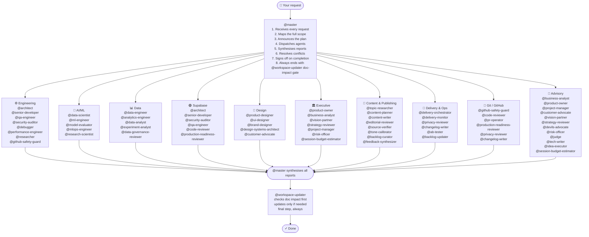

# claude-team-kit

[](https://github.com/Konstantinos-Sakellariou/claude-team-kit/actions/workflows/validate.yml)


A production-ready workspace kit for Claude-style coding tools. It gives any repo a professional AI team through agent prompts, skills, rules, hooks, and persistent memory.

It is designed to be copied into a real repo, customized quickly, and then used through one orchestrator: `@master`.

This kit supports a local vision and roadmap model.
Use [`docs/VISION.example.md`](docs/VISION.example.md) and [`docs/ROADMAP.example.md`](docs/ROADMAP.example.md) as tracked starters, and keep real `docs/VISION.md` / `docs/ROADMAP.md` local when they contain private strategy or sequencing.

It also now has an explicit durable-memory model.
Use [`docs/DURABLE_MEMORY.md`](docs/DURABLE_MEMORY.md) for the tracked public architecture, and keep repo-specific product, POC, and operating reality in `.claude/local-context/`.

There is also now a public-safe optional graph/repo-intelligence model.
Use [`docs/GRAPH_INTELLIGENCE.md`](docs/GRAPH_INTELLIGENCE.md) for the architecture and rollout boundary, while keeping any future index or intelligence tooling optional.

There is also now a public-safe future app-surface boundary.
Use [`docs/APP_SURFACE_AND_MCP.md`](docs/APP_SURFACE_AND_MCP.md) to understand what should stay repo-native, what could later become app-native, and how MCP-connected systems should fit without weakening the private operating boundary.

There is also now a public-safe Artifacts stance.
Use [`docs/ARTIFACTS.md`](docs/ARTIFACTS.md) for how Artifacts can support onboarding and explanation without replacing the repo as the source of truth.

There is also now a public-safe Agent SDK user-input stance.
Use [`docs/AGENT_SDK_USER_INPUT.md`](docs/AGENT_SDK_USER_INPUT.md) for how future structured-question and approval flows could fit a host app without pretending the current repo already supports them.

There is also now a public-safe cross-tool portability stance.
Use [`docs/CROSS_TOOL_PORTABILITY.md`](docs/CROSS_TOOL_PORTABILITY.md) for how the kit should adapt across hosts without splitting the canonical core or rushing into brittle export tooling.

If you want the big-picture explanation of the recent boundary cleanup, portability model, and graph-versus-code-intelligence split, use [`docs/PORTABILITY_AND_INTELLIGENCE_OVERVIEW.md`](docs/PORTABILITY_AND_INTELLIGENCE_OVERVIEW.md).

## Quick Start

If you want the easiest possible start:

1. Copy or template this repo into your project.
2. Run the setup and validation commands.
3. Start with `@master` and describe what you want to build, even if the repo is still underdefined.
4. Let the kit guide bootstrap, backlog, and local-context decisions as needed.

```bash
./scripts/setup.sh
./scripts/doctor.sh
python3 -m unittest discover -s tests -v
```

Good first prompts:
- `@master help me bootstrap this repo for a SaaS app`
- `@master customize this repo for the actual product we are building`
- `@master turn this into a Supabase product workspace`
- `@master review this repo and tell me the best next 3 moves`

You do not need to know the full agent roster to get started. The normal entrypoint is still:

**Every request goes through `@master`. Always.**

## How Orchestration Works

You never call specialist agents directly. You talk to `@master`, and it decides who runs, in what order, and whether things happen in parallel or sequentially — then synthesises everything back into one coherent response.

By default, `@master` also reports which teams and agents were selected, what each one did, and the outcome of the orchestration run. If no delegation was needed, `@master` should say that explicitly instead of silently skipping the report.

When the request is broad, strategic, or repo-shaping, `@master` should also use a simple listening pattern:
- `Listen`
- `Summarize`
- `Deepen`

That means understanding first, reflecting the intent back briefly, and only then widening the work or asking follow-up questions.

For all tasks, `@master` should at least report:
- whether delegation happened
- which teams or agents ran, or that `@master` handled it alone
- what happened
- what comes next

For significant work, the report should also make clear:
- which team was primary, if a team was used
- who led that team
- why that team was activated

## What's Inside

```text
.claude/
├── agents/          53 specialized agents across engineering, AI/ML, data, design, content, delivery, and advisory
├── teams/           10 reusable team manifests that @master can activate for recurring workflows
├── skills/          20 reusable skills (code-review, fix-bug, business-case, create-pr, context-audit, triage-input, repo-cleanup...)
├── rules/           Modular rule files — docs, artifacts, context, Python, TypeScript, security, testing, git, performance, API design, AI/ML workflow
├── hooks/           Shell automations (auto-format, secret detection, file protection, doc-drift warning, tracked-artifact warning...)
├── agent-memory/    Persistent per-agent memory (grows over time)
└── local-context/   Optional local-only business, customer, and strategy context
BACKLOG.example.md   Starter for the private local backlog file
docs/BACKLOG.example.md
                    Starter for an optional tracked public backlog
docs/DOCUMENTATION_GOVERNANCE.md
                    Anti-bloat documentation policy
docs/ROADMAP.example.md
                    Starter for a local repo-specific roadmap
docs/SELF_UPGRADE.md
                    Maintainer guide for evolving the kit safely
docs/STARTER_PACKS.md
                    Optional project-shape overlays for faster repo customization
docs/SYSTEM_REFERENCE.md
                    Full feature inventory and connection map
docs/VISION.example.md
                    Starter for a local repo-specific vision brief
CLAUDE.md            Master project briefing — customize per project
AGENTS.md            Compatibility briefing for tools that read AGENTS.md
.mcp.json            MCP server config (GitHub pre-configured)
docs/                Workflow and architecture documentation
scripts/             Setup and validation helpers
.env.example         Optional local environment template
```

The full feature and connection map lives in [`docs/SYSTEM_REFERENCE.md`](docs/SYSTEM_REFERENCE.md).

## Durable Memory

This kit treats memory as an architecture layer, not just a side effect of long chats.

The model is intentionally split:
- tracked agent memory for reusable heuristics
- backlog, plans, and ADRs for durable work and decisions
- local context for private current reality
- handoff and estimation logs for local session continuity

The important boundary is:
- public tracked memory explains reusable kit truth
- local memory carries private product, customer, roadmap, and POC truth

See [`docs/DURABLE_MEMORY.md`](docs/DURABLE_MEMORY.md) for the full architecture.

## Graph Intelligence

This kit now has an explicit stance on graph/repo intelligence:
- potentially valuable
- especially useful for larger artifact sets and future productization
- optional by design

The intended use is a relationship layer across docs, plans, ADRs, workflows, teams, and local context, not a mandatory graph database in the core.

It should also stay distinct from any later code-intelligence layer:
- graph/repo intelligence = artifact relationships
- code intelligence = code-aware search, symbols, dependencies, and retrieval

See [`docs/GRAPH_INTELLIGENCE.md`](docs/GRAPH_INTELLIGENCE.md) for the full model.

## App Surface And MCP Systems

This kit now also defines the future product boundary explicitly:
- the repo remains the canonical configuration and durable-artifact layer
- any later app surface should be an interactive operating layer on top, not a replacement for the repo model
- MCP-connected systems should be added only when they materially improve a real operator workflow

See [`docs/APP_SURFACE_AND_MCP.md`](docs/APP_SURFACE_AND_MCP.md) for the boundary, first candidate workflows, and privacy rules.

## Artifacts Companion Layer

This kit now also defines a safe stance on Claude Artifacts:
- Artifacts are optional companion surfaces
- they are useful for explainers, selectors, demos, and onboarding
- they should not replace tracked docs or private local context

See [`docs/ARTIFACTS.md`](docs/ARTIFACTS.md) for the boundary and best first use cases.

## Agent SDK User Input

This kit now also defines a safe stance on future Agent SDK user-input integration:
- useful for structured questions and approval-heavy workflows
- a strong fit for bootstrap, planning, and release checkpoints
- not something the markdown-only core should claim to support natively today

See [`docs/AGENT_SDK_USER_INPUT.md`](docs/AGENT_SDK_USER_INPUT.md) for the compatibility boundary.

## Cross-Tool Portability

This kit now also defines a safe stance on portability across coding hosts:
- `.claude/` remains the canonical shared core
- repo customization and tool adaptation are separate jobs
- portability should start with guidance and a clear adapter contract, not tool-chasing

See [`docs/CROSS_TOOL_PORTABILITY.md`](docs/CROSS_TOOL_PORTABILITY.md) for the model.

## Context Efficiency

This kit should stay efficient as well as capable.

That means:
- keep always-loaded briefing files high-signal
- prefer narrow reads before broad repo sweeps
- triage large logs, diffs, and dumps before handing raw output to the model
- use a default large-input workflow: classify, sample, summarize, then hand off narrowly
- prefer durable artifacts over repeating long chat recaps
- use only the tools and MCP servers the task actually needs

See [`docs/CONTEXT_EFFICIENCY.md`](docs/CONTEXT_EFFICIENCY.md) for the full guidance, including request-shaping, large-input triage, and optional RTK usage. If you want the dedicated optional integration path, use [`docs/RTK_INTEGRATION.md`](docs/RTK_INTEGRATION.md).

This kit also now has an explicit model-routing stance:
- `Haiku` for cheap summarization and repetitive low-risk condensation
- `Sonnet` as the default for most implementation and docs work
- `Opus` for architecture, contested decisions, deep debugging, and other genuinely heavy reasoning tasks

Low-risk cheaper-by-default agents now include:
- `@backlog-curator`
- `@changelog-writer`
- `@feedback-synthesizer`
- `@delivery-monitor`

## GitHub Quality Gate

This kit now treats GitHub-bound code as a high-standard surface.
For code-affecting commit, push, and PR flows, the default expectation is:
- safety review
- code review
- test adequacy review
- production-readiness review when the change is risky enough

`@master` should also ask for a quick sync check or pull before substantial collaborative work when the branch may be stale.

See [`@.claude/rules/github-quality-gate.md`](.claude/rules/github-quality-gate.md), [`docs/RELEASE_GOVERNANCE.md`](docs/RELEASE_GOVERNANCE.md), and [`docs/TEAMS.md`](docs/TEAMS.md) for the full gate and team flow.

Two repo-native skills now support this directly:
- `context-audit` for auditing briefing quality, doc drift, and artifact placement
- `triage-input` for compressing noisy logs, diffs, dumps, and large evidence into a smaller next step

When the input is especially noisy, the expected pattern is still specialist-first: triage, summarize the signal, then route narrowly instead of widening immediately.

## Release Governance

This kit also includes a stricter release-governance layer for release-heavy or merge-critical work.

That flow strengthens the Git / GitHub team with:
- safety review
- privacy review
- code and QA gates
- production-readiness review
- changelog / release-note coverage
- final risk sign-off

See [`docs/RELEASE_GOVERNANCE.md`](docs/RELEASE_GOVERNANCE.md) for the full model.

## How To Ask Well

High-signal requests make the system both cheaper and better. Best inputs usually include:
- exact file paths when you know them
- exact errors or failing commands when you have them
- what outcome you want
- any constraints, such as "do not change behavior" or "docs only"

Examples:
- "Update [`README.md`](README.md) to explain the new setup flow."
- "Fix the failing doctor check in [`scripts/doctor.sh`](scripts/doctor.sh)."
- "Review the auth changes in `src/auth.ts` and focus on security regressions."

Lower-signal requests are still okay, but they usually cost more context:
- "scan the whole repo"
- "fix bugs everywhere"
- "read this huge log and tell me what happened" without narrowing

If your request starts broad, `@master` should help narrow it before doing a large sweep. See [`docs/CONTEXT_EFFICIENCY.md`](docs/CONTEXT_EFFICIENCY.md) for the full request-shaping guidance.

## New Repo Bootstrap

When this kit is copied into a repo other than `claude-team-kit`, `@master` should check whether the project briefing still looks generic before major work starts.

If it does, `@master` should switch into a guided initialization style:
- ask in small rounds
- accept partial answers
- offer candidate answers when the user is unsure
- stop as soon as the repo briefing is strong enough for normal work

When the repo is really founder-shaped, product-shaped, or company-building from the start, bootstrap can also expand into a company-building workflow:
- clarify product and customer context
- identify the first reliable operating loop
- separate safe tracked repo truth from private local strategy or POC context

See [`docs/BOOTSTRAP.md`](docs/BOOTSTRAP.md) for the full bootstrap model.

## Repo Customization

Bootstrap is not the whole story.

Some repos are no longer generic, but still not specific enough.
That is where repo customization should start.

Customization means:
- keep the shared kit layer reusable
- tighten the repo-specific overlay
- improve the actual project briefings, commands, local-context structure, and specialist routing where the generic defaults are no longer enough

Use [`docs/PROJECT_CUSTOMIZATION.md`](docs/PROJECT_CUSTOMIZATION.md) for the full model, including:
- bootstrap vs customization
- core kit layer vs repo-specific overlay
- when `@master` should recommend `/customize-repo`

## Private Local Context

Some repos need a second context layer that should help agents locally but should not become part of tracked repo history.

Use `.claude/local-context/` for private startup, customer, company, or strategy notes. Use `.claude/local-context/HANDOFF.md` when a session stops mid-stream and another model or tool needs a compact resume artifact.

That same local layer is also the right place for private proof-of-concept or core-product incubation work. `@master` can use it as local decision support, but the tracked repo should keep publishing only reusable kit-safe truth unless you explicitly approve a public summary.

See [`docs/LOCAL_CONTEXT.md`](docs/LOCAL_CONTEXT.md) for the full model and privacy boundary.

## Vision Alignment

This repo now has an explicit direction.

When adding backlog items, plans, agents, teams, rules, hooks, or skills, we should ask:
- does this strengthen the reusable workspace kit?
- does it move the repo toward a stronger digital-product or digital-company operating model?
- does it belong in the core, or only in a plan/customization layer?

Use [`docs/VISION.example.md`](docs/VISION.example.md) as the public model for how a vision doc should work, and use local `docs/VISION.md` as the actual filter when a repo has one.

Use [`docs/DOCUMENTATION_GOVERNANCE.md`](docs/DOCUMENTATION_GOVERNANCE.md) to keep the core briefings lean while the repo grows, and [`docs/SYSTEM_REFERENCE.md`](docs/SYSTEM_REFERENCE.md) when you need the full feature map instead of a hot-path summary.

## Roadmap And Backlog

This kit now treats roadmap, backlog, and plans as separate but connected surfaces:

- [`docs/ROADMAP.example.md`](docs/ROADMAP.example.md) shows the roadmap structure the kit expects
- local `docs/ROADMAP.md` is where a repo can keep its real phased priorities if they should stay private
- `BACKLOG.md` is the local private registry of future work and follow-ups
- `docs/BACKLOG.md` is the optional tracked public backlog for repos that want visible backlog history
- `docs/plans/` should stay mostly for public-safe examples and intentionally shareable references
- `.claude/local-context/plans/` should hold real likely-next implementation plans when they expose current strategy or sequencing
- once backlog mode is chosen explicitly, `@master` and `@backlog-updater` should remember it and reuse it unless the user overrides it
- `.claude/local-context/HANDOFF.md` is the local-only continuity artifact for unfinished sessions, cross-model/tool handoff, or compact next-step context

Important boundary:
- approving a plan is not the same as approving a tracked public plan
- when visibility is unclear, `@master` should ask whether the plan stays local or becomes tracked
- the safer local path should be the default recommendation for real next-step implementation direction

Use the roadmap to decide sequence and milestone fit.
Use the backlog to capture concrete items and deferred work.

When the main question is capacity rather than raw importance, use `@session-budget-estimator`:
- `Session Mode` for what fits in real Claude/Codex work sessions
- `Roadmap Mode` for sequencing and phase fit
- `Hybrid Mode` for both together

Real estimate-versus-actual history should stay local in `.claude/local-context/estimation-log.md`.

When the main question is strategic fit rather than capacity, use `@strategy-reviewer`:
- `Strong fit`, `Moderate fit`, `Weak fit`, or `Misaligned`
- explicit pushback when an addition costs more than it adds
- a narrower or better-timed alternative when the underlying idea is directionally useful

When the main question is collaborative direction-shaping rather than critique or estimation, use `@vision-partner`:
- generate a small set of strong next-move options grounded in current repo state
- connect backlog, roadmap, and vision into a clearer recommendation
- pair well with `@strategy-reviewer` for pushback and `@session-budget-estimator` for feasibility

## Starter Packs

This kit now includes optional starter packs for common repo shapes.

Use [`docs/STARTER_PACKS.md`](docs/STARTER_PACKS.md) when a copied repo clearly behaves like a:
- SaaS app
- API service
- AI/ML product
- startup studio

The packs are not part of the runtime model.
They are adaptation overlays that help bootstrap and customization converge faster.

## Solution Packs

This kit can also grow into optional solution packs for common startup and product foundations.

Use [`docs/SOLUTION_PACKS.md`](docs/SOLUTION_PACKS.md) for the public-safe contract:
- starter packs shape the repo type
- solution packs shape the stack foundation
- integration adapters handle provider-specific wiring where needed

`@master` should recommend the most relevant pack when a repo or request clearly matches one.

The first intended pack wave is:
- Supabase application foundation
- GitHub + CI/CD foundation
- Vercel deployment foundation

The first concrete packs are now:
- [`Supabase Application Foundation`](docs/solution-packs/supabase-foundation.md)
- [`GitHub And CI/CD Foundation`](docs/solution-packs/github-cicd-foundation.md)
- [`Vercel Deployment Foundation`](docs/solution-packs/vercel-foundation.md)

## Design Packs

This kit can also grow into optional design packs for visual, brand, and design-system foundations.

Use [`docs/DESIGN_PACKS.md`](docs/DESIGN_PACKS.md) for the contract:
- starter packs shape the repo type
- solution packs shape the stack foundation
- design packs shape the visual foundation

`@master` should recommend the most relevant design pack when a repo or request clearly matches one.

`DESIGN.md` is supported as an optional compact design brief, not a required core artifact.

The first reusable design-pack library now includes:
- [`Clean SaaS Product`](docs/design-packs/clean-saas.md)
- [`Startup Studio / Founder Service`](docs/design-packs/startup-studio.md)
- [`Premium Service / Advisory`](docs/design-packs/premium-service.md)
- [`Technical Console / Dashboard`](docs/design-packs/technical-console.md)

## Team Overview



**The orchestration loop — what `@master` does on every request:**

```
RECEIVE → ANALYSE scope → PLAN pipeline → ANNOUNCE plan to user
  → DISPATCH agents (parallel where independent, sequential where dependent)
  → COLLECT all reports → SYNTHESISE findings → RESOLVE conflicts
  → DECIDE: more work needed? → loop | user decision needed? → surface it | done? → sign off
  → TRIGGER @workspace-updater doc-impact gate → COMPLETE
```

`@workspace-updater` runs automatically as the last step after significant work, but as a final doc-impact gate first, not as an automatic full rewrite. It checks whether the core docs (`CLAUDE.md`, `AGENTS.md`, and `README.md`) were actually affected, performs a targeted sync only when needed, and can intentionally defer broader doc drift until a better sync point.

## What Teams Mean

Teams are reusable orchestration bundles that `@master` can activate for recurring workflows. They keep routing consistent without hiding the actual specialists that ran.

## Available Teams

| Team | Typical Use |
|---|---|
| `Engineering Team` | implementation, debugging, architecture, engineering review |
| `AI/ML Team` | model framing, training, evaluation, rollout readiness |
| `Data Team` | pipelines, warehouse modeling, analytics, experimentation, data governance |
| `Supabase Team` | auth, schema, migrations, RLS, storage, edge functions, rollout safety |
| `Design Team` | product UX, UI layout, design-system consistency, brand-sensitive presentation work |
| `Executive Team` | executive/org-model architecture, company-operating structure, and public/private operating-boundary work |
| `Content & Publishing Team` | planning, drafting, editorial review, source-backed publishing |
| `Delivery & Ops Team` | release, delivery, monitoring, privacy, backlog persistence |
| `Git / GitHub Team` | commit, push, PR, release readiness, branch hygiene, repo-safety review |
| `Advisory Review Team` | planning, prioritization, strategy, business, and next-move support |

The canonical team definitions live in `.claude/teams/`. See [`docs/TEAMS.md`](docs/TEAMS.md) for the full model and operating rules, [`docs/SUPABASE_REFERENCE.md`](docs/SUPABASE_REFERENCE.md) for the Supabase-specific reference, [`docs/DATA_REFERENCE.md`](docs/DATA_REFERENCE.md) for the data-domain reference, and [`docs/DESIGN_REFERENCE.md`](docs/DESIGN_REFERENCE.md) for the design-domain reference.

**Parallel vs sequential — `@master` decides:**

> *"Add authentication to the API"*
> → **Parallel:** `@architect` + `@researcher` (no dependency between them)
> → **Then sequential:** `@senior-developer` (needs both outputs)
> → **Then parallel:** `@qa-engineer` + `@security-auditor` (both review independently)
> → **Then sequential:** `@risk-officer` → `@workspace-updater`

> *"Plan and publish next week's newsletter"*
> → **Sequential:** `@backlog-curator` → `@topic-researcher`
> → **Then parallel:** `@content-planner` + `@source-verifier`
> → **Human approval gate** → `@content-writer`
> → **Then parallel:** `@editorial-reviewer` + `@tone-calibrator` + `@source-verifier`
> → **Then sequential:** `@privacy-reviewer` → `@delivery-orchestrator` → `@workspace-updater`

> *"Evaluate and operationalize a churn model"*
> → **Sequential:** `@data-scientist` (problem framing, baselines, feature intent)
> → **Then:** `@ml-engineer` (training pipeline and reproducible implementation)
> → **Mandatory gate:** `@model-evaluator` (metrics, fairness, release readiness)
> → **Then:** `@mlops-engineer` (rollout, monitoring, lifecycle)
> → **Optional advisory:** `@research-scientist` when a novel approach or literature review is needed

**See full workflow diagrams** with all collaboration patterns (parallel stages, gated reviews, feedback loops, dual-track launches, and idea-to-plan execution) in [`docs/AGENT_WORKFLOWS.md`](docs/AGENT_WORKFLOWS.md).

Detailed automatic delegation rules, routing policy, and the full agent roster live in [`CLAUDE.md`](CLAUDE.md), [`AGENTS.md`](AGENTS.md), and [`docs/SYSTEM_REFERENCE.md`](docs/SYSTEM_REFERENCE.md).

## ADR Decision Flow

ADRs are not special-case paperwork. They are the default traceability mechanism for durable decisions.

- If a discussion changes architecture, policy, workflow, repo structure, or long-lived operating conventions, `@master` should propose an ADR by default
- `@architect` owns the technical substance of the decision
- `@devils-advocate` and `@judge` help pressure-test the reasoning
- `@tech-writer` writes the final ADR once the user approves saving it
- `@workspace-updater` then aligns the rest of the repo docs

`@master` must still ask for explicit approval before writing anything into `docs/adr/`.

## Workflow Commands

This kit now supports a thin command layer on top of agents, teams, and skills.

Commands are explicit workflow entrypoints.
They do not bypass `@master`; they simply help users trigger repeatable multi-step flows more consistently.

Current command set:
- `/bootstrap-repo`
- `/customize-repo`
- `/save-backlog`
- `/plan-idea`
- `/write-adr`
- `/release-check`
- `/sync-docs`
- `/triage-input`
- `/context-audit`

These command definitions live in `.claude/commands/`.

The reusable skills still matter underneath that layer, including:
- `code-review`
- `fix-bug`
- `write-tests`
- `refactor`
- `security-audit`
- `optimize-performance`
- `write-docs`
- `explain-code`
- `git-commit`
- `create-pr`
- `business-case`
- `sprint-planning`
- `research`
- `daily-standup`
- `retrospective`
- `repo-cleanup`

## Self-Upgrade

This kit should be able to evolve itself without drifting or re-bloating.

Use [`docs/SELF_UPGRADE.md`](docs/SELF_UPGRADE.md) when changing agents, teams, commands, skills, rules, hooks, artifact policy, or core workflow behavior.

The short version is:
- update the canonical implementation in `.claude/`
- update only the right summary docs and focused docs
- keep public vs local boundaries clean
- run doctor and tests before calling the upgrade done

## Setup and Validation

- `./scripts/setup.sh` makes hook scripts executable and creates local config files from examples when needed
- `./scripts/doctor.sh` checks repo structure, JSON validity, hook permissions, and key documentation references
- `python3 -m unittest discover -s tests -v` runs the lightweight validation test suite for hooks and doctor behavior
- `docs/ARCHITECTURE.md` explains the product boundary and canonical sources
- `docs/DOCUMENTATION_GOVERNANCE.md` explains how to keep the repo fully documented without hot-path bloat
- `docs/BOOTSTRAP.md` explains how `@master` should initialize a new repo briefing when this kit is copied elsewhere
- `docs/CONTEXT_EFFICIENCY.md` explains how to keep briefing files lean, requests high-signal, and large inputs under control
- `docs/LOCAL_CONTEXT.md` explains the private local context layer and its privacy boundary
- `docs/DURABLE_MEMORY.md` explains how agent memory, backlog, plans, ADRs, local context, and handoff artifacts fit together
- `docs/GRAPH_INTELLIGENCE.md` explains the optional graph/repo-intelligence layer and where it may fit later
- `docs/SYSTEM_REFERENCE.md` gives the full feature inventory, system connections, and navigation map
- `docs/TEAMS.md` explains the reusable team abstraction and how `@master` uses it
- `docs/PROJECT_CUSTOMIZATION.md` shows how to turn the generic kit into a real project briefing
- `repo-cleanup` is the direct cleanup skill for pruning or customizing copied-kit leftovers safely

## Where To Go Next

- full feature inventory and agent/team map: [`docs/SYSTEM_REFERENCE.md`](docs/SYSTEM_REFERENCE.md)
- reusable team model: [`docs/TEAMS.md`](docs/TEAMS.md)
- orchestration examples and workflow diagrams: [`docs/AGENT_WORKFLOWS.md`](docs/AGENT_WORKFLOWS.md)
- architecture and repo boundary: [`docs/ARCHITECTURE.md`](docs/ARCHITECTURE.md)
- adaptation into a real repo: [`docs/PROJECT_CUSTOMIZATION.md`](docs/PROJECT_CUSTOMIZATION.md)
- documentation policy and anti-bloat rules: [`docs/DOCUMENTATION_GOVERNANCE.md`](docs/DOCUMENTATION_GOVERNANCE.md)

## Customizing for Real Projects

When you copy this kit into a live repo, keep the shared `.claude/` layer mostly intact and make the repo-specific details explicit in `CLAUDE.md` and `AGENTS.md`.

Good project briefings usually add:

- real stack, commands, deployment flow, and environment rules
- route or page inventories for app repos
- domain-specific gotchas that prevent agent mistakes
- automatic delegation rules that reflect the actual codebase
- documentation sync targets for route catalogs, brief docs, or other registries

## Idea Artifact Policy

Planning outputs should be stored professionally and consistently:

- keep early idea exploration in chat
- save deferred work in the chosen backlog:
  - private local `BACKLOG.md`
  - or tracked public `docs/BACKLOG.md`
- for important deferred work, prefer a backlog entry plus a linked plan
- save public-safe implementation plans in `docs/plans/`
- keep private strategy or roadmap plans in `.claude/local-context/plans/`
- save approved architecture or policy decisions in `docs/adr/`

`@master` must ask for explicit approval before saving anything into `docs/plans/` or `docs/adr/`.

If backlog preference is not known yet, `@master` should ask whether the project wants a private local backlog or a public tracked backlog before persisting backlog items.

## Customisation

- Edit `CLAUDE.md` to configure the project name, stack, commands, and notes
- Use `BACKLOG.example.md` as the tracked starter and `BACKLOG.md` as the local ignored registry for deferred work and captured ideas
- Use `docs/BACKLOG.example.md` if you want a tracked public backlog at `docs/BACKLOG.md`
- Use `.claude/local-context/` for sensitive local-only startup, customer, or strategy context
- Use `.claude/local-context/HANDOFF.md` as the compact local resume artifact when work stops mid-stream or another model/tool needs continuity
- Use `docs/PROJECT_CUSTOMIZATION.md` when adapting the kit to a specific repository
- Add project-specific rules with `@.claude/rules/your-rule.md` in `CLAUDE.md`
- Create new agents in `.claude/agents/` — copy any existing file and update the frontmatter and instructions
- Add skills in `.claude/skills/your-skill/SKILL.md`
- Hook scripts auto-run — configure which fire in `settings.json`
- Agent memory grows automatically in `.claude/agent-memory/<agent-name>/MEMORY.md`

## Documentation

| File | What it covers |
|---|---|
| `CLAUDE.md` | Project or repo briefing for Claude-compatible tools |
| `AGENTS.md` | Compatibility briefing for tools that consume AGENTS.md |
| `README.md` | Kit overview, agent roster, orchestration model |
| `BACKLOG.example.md` | Starter for a private local backlog at `BACKLOG.md` |
| `docs/BACKLOG.example.md` | Starter for a tracked public backlog at `docs/BACKLOG.md` |
| `docs/ARCHITECTURE.md` | Product boundary, canonical sources, maintenance priorities |
| `docs/BOOTSTRAP.md` | New-repo bootstrap behavior, trigger rules, and adaptive question flow |
| `docs/CONTEXT_EFFICIENCY.md` | Context-quality rules, request-shaping, and large-input triage guidance |
| `docs/DOCUMENTATION_GOVERNANCE.md` | Hot-path summary policy, linkback rules, and anti-bloat documentation guidance |
| `docs/LOCAL_CONTEXT.md` | Private local-context model for sensitive company, customer, and strategy notes |
| `docs/DURABLE_MEMORY.md` | Durable-memory architecture, retrieval model, privacy boundary, and future expansion path |
| `docs/GRAPH_INTELLIGENCE.md` | Optional graph/repo-intelligence architecture, scope boundary, and rollout path |
| `docs/SYSTEM_REFERENCE.md` | Full feature inventory, connections, and usage/navigation map |
| `docs/TEAMS.md` | Team abstraction, reusable manifests, and team operating rules |
| `docs/PROJECT_CUSTOMIZATION.md` | How to adapt the generic kit to a concrete repo |
| `docs/AGENT_WORKFLOWS.md` | Detailed workflow diagrams with parallel/sequential/gated patterns |

`README.md`, `CLAUDE.md`, and `AGENTS.md` must stay in sync. Update them together whenever the agent roster, workflow, commands, or project structure changes. `@workspace-updater` now handles this as an adaptive doc-impact gate after major tasks — or call `/sync-docs` explicitly after manual changes or when drift was deferred on purpose.
