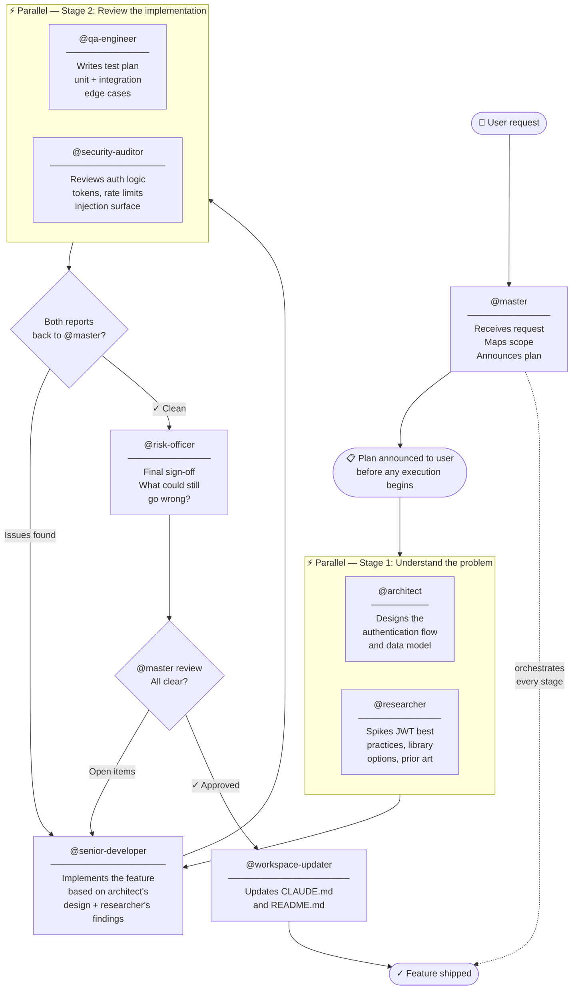

# Agent Workflows

All work flows through `@master`. Every example below starts and ends there.

`@master` receives the request, maps the full scope, announces the plan to the user before executing, dispatches agents (in parallel or sequentially depending on dependencies), synthesises their reports, resolves conflicts, and — once the user confirms — triggers `@workspace-updater` as the mandatory final step.

Three workflows are documented here, each demonstrating different collaboration patterns:

1. **Engineering Pipeline** — parallel spikes, sequential implementation, gated quality stages
2. **Content Publishing Pipeline** — research loop, human approval gate, parallel review, delivery feedback loop
3. **Full Project Launch** — dual parallel tracks (engineering + content) converging at a shared release gate

---

## Workflow 1 — Engineering Pipeline

**Example trigger:** *"Add rate-limited authentication to the API"*

**Patterns demonstrated:** parallel research, sequential implementation, parallel QA + security, risk gate, workspace update.



**Key points:**
- `@architect` and `@researcher` run **in parallel** — they have no dependency on each other
- `@senior-developer` runs **after both** — it needs their outputs
- `@qa-engineer` and `@security-auditor` run **in parallel** — both review the same implementation independently
- `@master` collects both reports and resolves any conflicts before passing to `@risk-officer`
- Failed gates loop back — `@master` routes to the appropriate fix stage rather than starting over

---

## Workflow 2 — Content Publishing Pipeline

**Example trigger:** *"Plan and publish next week's newsletter"*

**Patterns demonstrated:** backlog-first research, human approval gate, parallel multi-reviewer stage, delivery execution, post-send feedback loop back to planning.

```mermaid
flowchart TD
    USER(["👤 Planning request"])
    USER --> MASTER

    MASTER["@master\n─────────────\nReceives request\nMaps full pipeline\nAnnounces plan"]

    MASTER --> BC

    BC["@backlog-curator\n──────────────────\nScores & ranks existing\ntopic candidates\nSurfaces top picks"]

    BC --> TR

    TR["@topic-researcher\n──────────────────\nFinds fresh sources\nfor top candidates\nAdds new finds"]

    TR --> STAGE1

    subgraph STAGE1 ["⚡ Parallel — Stage 1: Build and validate the plan"]
        direction LR
        CP["@content-planner\n─────────────────\nBuilds structured\nweekly plan\nwith angles + prompts"]
        SV1["@source-verifier\n─────────────────\nValidates source\ncandidates\nbefore planning locks in"]
    end

    STAGE1 --> HGATE{["👤 Human approval\nReview the plan\nbefore any writing"]}

    HGATE -->|"Changes requested"| TR
    HGATE -->|"✓ Approved"| CW

    CW["@content-writer ✦ opus\n────────────────────────\nWrites the full draft\nAudience-appropriate\n~5 min read with sources"]

    CW --> STAGE2

    subgraph STAGE2 ["⚡ Parallel — Stage 2: Review the draft"]
        direction LR
        ER["@editorial-reviewer\n──────────────────\nReadability, value,\nsource quality,\ndiscussion prompt"]
        TC["@tone-calibrator\n──────────────────\nVoice and complexity\nfit for this\nspecific audience"]
        SV2["@source-verifier\n──────────────────\nFinal source check\nAll links live\nAll claims supported"]
    end

    STAGE2 --> GATE1{"@master synthesis\nAll reviewers\npassed?"}

    GATE1 -->|"Revisions needed"| CW
    GATE1 -->|"✓ All clear"| PR

    PR["@privacy-reviewer\n──────────────────\nPre-publish scan\nNo PII, no secrets\nno private data"]

    PR --> DO

    DO["@delivery-orchestrator\n──────────────────────\nRenders HTML + plain text\nChecks all gates passed\nDelivers via configured channel\nArchives edition"]

    DO --> DM

    DM["@delivery-monitor\n──────────────────\nReads delivery receipt\nFlags bounces or errors\nWrites health summary"]

    DM --> FS

    FS["@feedback-synthesizer\n──────────────────────\nProcesses audience replies\nExtracts follow-up signals\nAdds to backlog"]

    FS -->|"Feeds next cycle"| BC

    DO --> WU

    WU["@workspace-updater\n───────────────────\nArchive path updated\nCLAUDE.md + README\ncurrent"]

    WU --> DONE(["✓ Edition delivered"])

    MASTER -. "orchestrates\nevery stage" .-> DONE
```

**Key points:**
- `@backlog-curator` runs **before** research — existing knowledge shapes what gets researched
- `@content-planner` and `@source-verifier` run **in parallel** — planning and validation are independent at this stage
- The **human approval gate** is explicit — no writing starts on an unapproved plan
- Three reviewers run **in parallel** — `@master` collects all three reports, resolves any conflicts, and decides pass/fail as a single gate
- The **feedback loop** is structural — `@feedback-synthesizer` routes back to `@backlog-curator` and closes the cycle

---

## Workflow 3 — Full Project Launch

**Example trigger:** *"Ship the new feature and announce it publicly"*

**Patterns demonstrated:** dual parallel tracks (engineering and content), converging release gate, post-launch experimentation, mandatory privacy scan, changelog, workspace update.

```mermaid
flowchart TD
    USER(["👤 Launch request"])
    USER --> MASTER

    MASTER["@master\n─────────────\nMaps full scope\nSplits into two tracks\nAnnounces full plan\nbefore execution"]

    MASTER --> ENG_TRACK
    MASTER --> CNT_TRACK

    subgraph ENG_TRACK ["⚙️ Engineering Track"]
        direction TB
        E1["@architect\nDesigns the feature"]
        E2["@researcher\nSpikes dependencies"]
        E3["@senior-developer\nImplementation"]
        E4["@qa-engineer\nTest coverage"]
        E5["@security-auditor\nSecurity review"]
        E6["@risk-officer\nRelease risk check"]

        E1 --> E3
        E2 --> E3
        E3 --> E4
        E3 --> E5
        E4 --> E6
        E5 --> E6
    end

    subgraph CNT_TRACK ["📝 Content Track"]
        direction TB
        C1["@topic-researcher\nAnnouncement angle\nand supporting context"]
        C2["@content-writer ✦ opus\nDrafts announcement\nrelease notes, blog post"]
        C3["@editorial-reviewer\nQuality gate"]
        C4["@tone-calibrator\nAudience fit check"]
        C5["@source-verifier\nAll claims verified"]

        C1 --> C2
        C2 --> C3
        C2 --> C4
        C2 --> C5
    end

    ENG_TRACK --> CONV
    CNT_TRACK --> CONV

    CONV(["@master synthesis\nBoth tracks complete?\nConflicts resolved?"])

    CONV -->|"Track issues"| MASTER
    CONV -->|"✓ Both tracks ready"| SHARED

    subgraph SHARED ["🔒 Shared Release Gate — Sequential"]
        direction TB
        S1["@privacy-reviewer\nMandatory pre-publish scan\nSecrets · PII · private paths"]
        S2["@devils-advocate\nWhat are we missing?\nWhat could still go wrong?"]
        S1 --> S2
    end

    SHARED --> HGATE{["👤 Final human\napproval before\npublic release"]}

    HGATE -->|"Concerns raised"| MASTER
    HGATE -->|"✓ Ship it"| POST

    subgraph POST ["🚀 Parallel — Post-launch"]
        direction LR
        P1["@delivery-orchestrator\nDeploys + announces\nvia all channels"]
        P2["@changelog-writer\nVersioned changelog entry"]
        P3["@ab-tester\nDesigns post-launch\nexperiment for\nheadlines/CTAs"]
    end

    POST --> DM

    DM["@delivery-monitor\nMonitors delivery\nflags any errors"]

    DM --> WU

    WU["@workspace-updater\nAll docs, CLAUDE.md,\nREADME updated"]

    WU --> DONE(["✓ Launched publicly"])

    MASTER -. "orchestrates\nboth tracks and\nall shared stages" .-> DONE
```

**Key points:**
- Both tracks start **simultaneously** — `@master` dispatches them at the same moment
- Neither track knows about the other — `@master` is the only entity holding both
- `@master` **converges** both tracks before the shared gate — it will wait for the slower track rather than letting one proceed alone
- `@devils-advocate` runs **after** privacy review — it challenges the entire plan at the last responsible moment
- The human final approval gate is the last checkpoint before any irreversible public action
- `@delivery-orchestrator`, `@changelog-writer`, and `@ab-tester` run **in parallel** post-approval — none depend on each other

---

## Reading These Diagrams

| Symbol | Meaning |
|---|---|
| `⚡ Parallel — Stage N` | Agents in this box run at the same time |
| Arrow `A → B` | B waits for A to complete |
| `@master synthesis` diamond | `@master` collects reports, resolves conflicts, decides next step |
| `👤 Human approval` diamond | Execution pauses — a human must decide before work continues |
| Dashed arrow `-.->` | `@master`'s continuous orchestration role across all stages |
| `✦ opus` | Agent uses the `claude-opus` model for higher-quality output |
| Loop arrow back | Gate failed — routes back to the appropriate fix stage |
