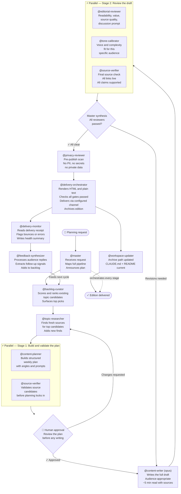
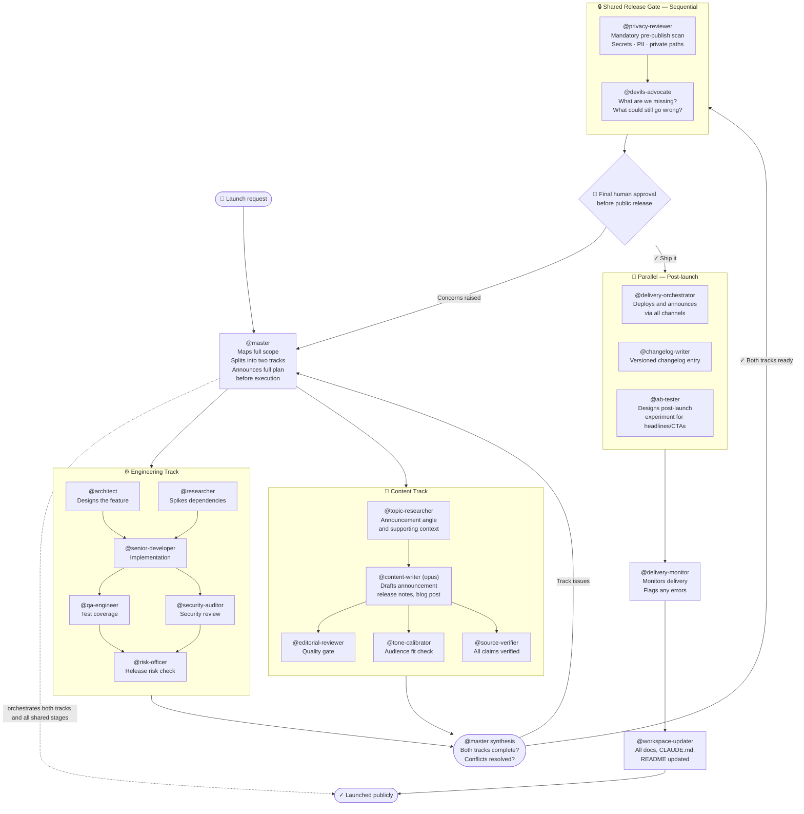
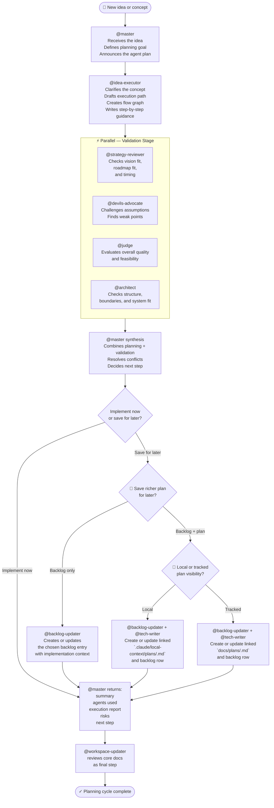
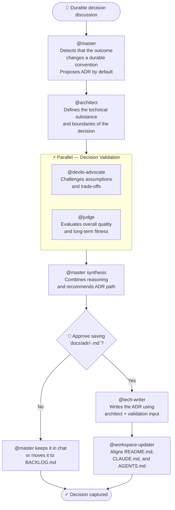
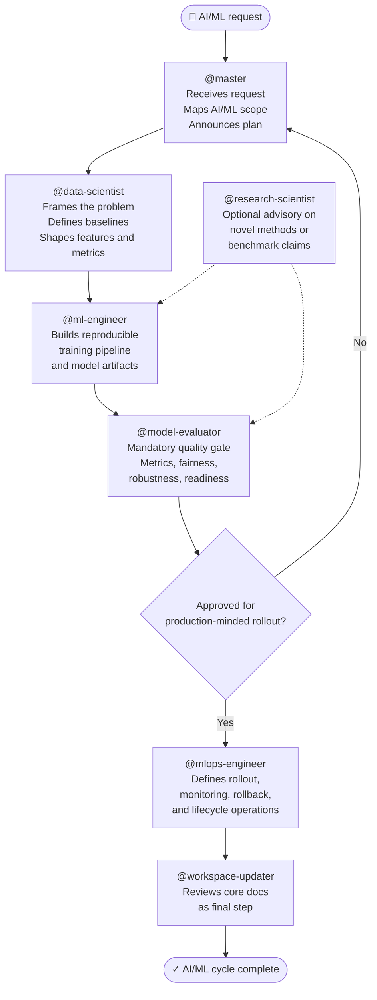
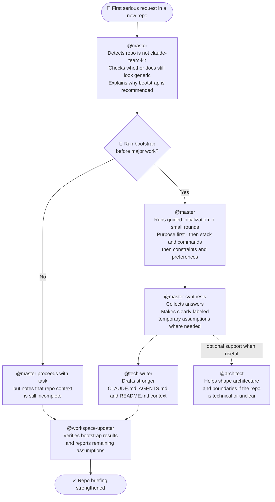
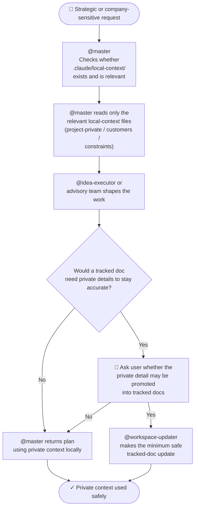
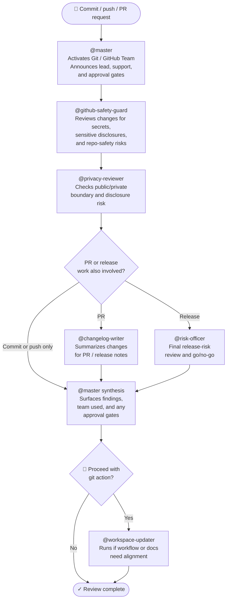
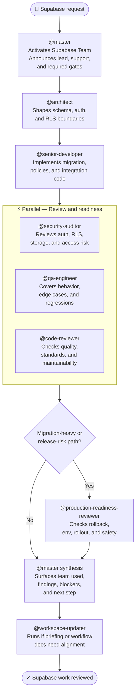
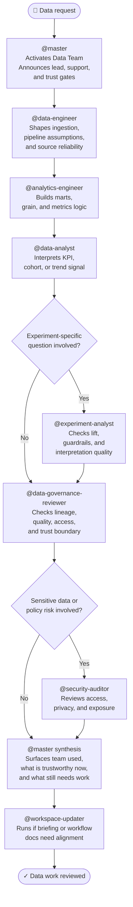

# Agent Workflows

All work flows through `@master`. Every example below starts and ends there.

`@master` receives the request, maps the full scope, announces the plan to the user before executing, dispatches agents (in parallel or sequentially depending on dependencies), synthesises their reports, resolves conflicts, and — once the user confirms — triggers `@workspace-updater` as the mandatory final step.

These workflows are also the reason the kit now defines reusable teams: when the same multi-agent shape appears repeatedly, `@master` can activate a team instead of reconstructing the orchestration pattern from scratch each time.

Eleven workflows are documented here, each demonstrating different collaboration patterns:

1. **Engineering Pipeline** — parallel spikes, sequential implementation, gated quality stages
2. **Content Publishing Pipeline** — research loop, human approval gate, parallel review, delivery feedback loop
3. **Full Project Launch** — dual parallel tracks (engineering + content) converging at a shared release gate
4. **Idea To Execution Planning** — idea shaping, strategic-fit review, adversarial validation, phased plan, optional backlog capture
5. **Decision To ADR** — durable-decision detection, validation, approval gate, ADR authorship, documentation alignment
6. **AI/ML Delivery Pipeline** — model framing, training, mandatory evaluation gate, operational rollout
7. **New Repo Bootstrap** — adaptive discovery, temporary assumptions, initial briefing alignment
8. **Private Local Context In Planning** — private-context lookup, safe planning support, tracked-doc boundary
9. **Git / GitHub Team Flow** — commit/push safety, PR readiness, and release-governance orchestration
10. **Supabase Team Flow** — schema/auth/RLS coordination with explicit security and rollout gates
11. **Data Team Flow** — ingestion, metrics, analysis, and trust gates for decision-ready data work

---

## Workflow 1 — Engineering Pipeline

**Example trigger:** *"Add rate-limited authentication to the API"*

**Patterns demonstrated:** parallel research, sequential implementation, parallel QA + security, risk gate, workspace update.

**Key points:**
- `@architect` and `@researcher` run **in parallel** — they have no dependency on each other
- `@senior-developer` runs **after both** — it needs their outputs
- `@qa-engineer` and `@security-auditor` run **in parallel** — both review the same implementation independently
- `@master` collects both reports and resolves any conflicts before passing to `@risk-officer`
- Failed gates loop back — `@master` routes to the appropriate fix stage rather than starting over

---

## Workflow 2 — Content Publishing Pipeline

**Example trigger:** *"Plan and publish next week's newsletter"*

**Patterns demonstrated:** backlog-first research, human approval gate, parallel multi-reviewer stage, delivery execution, post-send feedback loop back to planning.

**Key points:**
- `@backlog-curator` runs **before** research — existing knowledge shapes what gets researched
- `@content-planner` and `@source-verifier` run **in parallel** — planning and validation are independent at this stage
- The **human approval gate** is explicit — no writing starts on an unapproved plan
- Three reviewers run **in parallel** — `@master` collects all three reports, resolves any conflicts, and decides pass/fail as a single gate
- The **feedback loop** is structural — `@feedback-synthesizer` routes back to `@backlog-curator` and closes the cycle

---

## Workflow 3 — Full Project Launch

**Example trigger:** *"Ship the new feature and announce it publicly"*

**Patterns demonstrated:** dual parallel tracks (engineering and content), converging release gate, post-launch experimentation, mandatory privacy scan, changelog, workspace update.

**Key points:**
- Both tracks start **simultaneously** — `@master` dispatches them at the same moment
- Neither track knows about the other — `@master` is the only entity holding both
- `@master` **converges** both tracks before the shared gate — it waits for the slower track rather than letting one proceed alone
- `@devils-advocate` runs **after** privacy review — it challenges the entire plan at the last responsible moment
- The human final approval gate is the last checkpoint before any irreversible public action
- `@delivery-orchestrator`, `@changelog-writer`, and `@ab-tester` run **in parallel** post-approval — none depend on each other

---

## Workflow 4 — Idea To Execution Planning

**Example trigger:** *"We have an idea for a backlog system and an execution-planning specialist. How should we shape it?"*

**Patterns demonstrated:** idea shaping, strategic-fit review, adversarial review, coordinated planning, backlog persistence, optional linked plan artifact, mandatory synthesis by `@master`.

**Key points:**
- `@idea-executor` is the primary planning specialist, not the top-level coordinator
- `@master` still owns the thread, announces the selected agents, and synthesizes the result
- `@strategy-reviewer`, `@devils-advocate`, `@judge`, and `@architect` are strong default validators for non-trivial ideas
- If the user wants to defer execution, `@backlog-updater` persists the idea in the chosen backlog
- For substantial deferred work, the best default is often backlog entry plus linked plan, not backlog row alone
- Approving a richer plan is separate from approving tracked visibility; `@master` should ask explicitly when that choice is not already clear
- Even planning-only work still ends with `@workspace-updater` reviewing the core docs

---

## Workflow 5 — Decision To ADR

**Example trigger:** *"We should make `@master` propose ADRs automatically for durable decisions."*

**Patterns demonstrated:** default ADR detection, adversarial validation, human approval gate, delegated authorship, final doc alignment.

**Key points:**
- `@master` should propose this flow by default when the decision should outlive the current conversation
- `@architect` owns the substance, but `@tech-writer` owns final ADR authorship
- `@devils-advocate` and `@judge` validate the reasoning before the record is written
- Saving to `docs/adr/` is still gated by explicit user approval
- `@workspace-updater` closes the loop so the ADR does not drift away from the repo briefings

---

## Workflow 6 — AI/ML Delivery Pipeline

**Example trigger:** *"Evaluate and operationalize a churn model for deployment."*

**Patterns demonstrated:** domain-specialist routing, sequential model pipeline, mandatory evaluation gate, optional frontier-research advisory, operational rollout.

**Key points:**
- `@data-scientist` starts the default AI/ML path with framing, baselines, and feature intent
- `@ml-engineer` turns that intent into reproducible training and artifact flow
- `@model-evaluator` is a hard gate, not a nice-to-have reviewer
- `@research-scientist` is advisory and only needs to run when novelty or literature fit matters
- `@mlops-engineer` should not lead before evaluation sign-off exists

---

## Workflow 7 — New Repo Bootstrap

**Example trigger:** *"We just copied this kit into a new startup repo. Help us set it up properly."*

**Patterns demonstrated:** adaptive discovery, guided initialization in small rounds, flexible questioning, temporary assumptions, initial doc alignment, final workspace sync.

**Key points:**
- bootstrap should not run inside `claude-team-kit` itself
- bootstrap should not interrupt already-customized repos
- `@master` should ask only high-signal questions, not a giant questionnaire
- when the repo is still vague, `@master` should use guided initialization in small rounds instead of a single dump of questions
- if the user is unsure, `@master` should help with candidate answers or repo-informed guesses
- users can answer partially; `@master` may make temporary assumptions and label them clearly
- `@workspace-updater` closes the loop by checking that the core docs now reflect the repo better than before

---

## Workflow 8 — Private Local Context In Planning

**Example trigger:** *"Help me shape the roadmap and messaging for this startup, but keep the sensitive company notes private."*

**Patterns demonstrated:** private-context lookup, planning support without disclosure, tracked-doc boundary.

**Key points:**
- `.claude/local-context/` is optional and local-only
- `@master` should read only the minimum relevant private file
- private context may guide planning without being copied into tracked docs
- when tracked docs would benefit from private context, the user must approve that promotion explicitly

---

## Workflow 9 — Git / GitHub Team Flow

**Example trigger:** *"Before I push and open a PR, run the full repo-safety and release-readiness check."*

**Patterns demonstrated:** reusable team activation, safety-first commit/push flow, PR prep support, optional release-risk gate.

**Key points:**
- `Git / GitHub Team` is the reusable coordination layer for commit, push, PR, and release-governance work
- `@github-safety-guard` remains the default lead for outgoing repo actions
- `@code-reviewer` acts as the code-quality and standards gate for code-affecting changes
- `@pr-operator` improves PR packaging and reviewer context when a PR is involved
- `@privacy-reviewer` stays explicit for disclosure-sensitive changes
- `@production-readiness-reviewer` is added when the path is merge-critical, migration-heavy, or release-heavy
- `@risk-officer` becomes the decisive gate only when the flow is truly release-heavy
- release-heavy paths should end in a visible `READY`, `READY WITH NOTED RISK`, or `NOT READY` summary
- before substantial work, `@master` should ask whether the branch needs a quick sync check when remote drift is plausible
- `@master` must surface the team, agents used, findings, and approval gate before any irreversible Git action

---

## Workflow 10 — Supabase Team Flow

**Example trigger:** *"Add Supabase auth with RLS-protected organizations and prepare the migration safely."*

**Patterns demonstrated:** reusable domain-team activation, schema plus auth coordination, mandatory security gate, optional production-readiness gate.

**Key points:**
- `Supabase Team` is the reusable coordination layer for Supabase-backed product work
- `@security-auditor` is mandatory for auth, RLS, storage, and sensitive access changes
- `@code-reviewer` stays part of code-affecting Supabase work
- `@production-readiness-reviewer` is added when migrations, rollout, or environment risk are meaningful
- the shared kit stays generic while the actual project-specific Supabase layout belongs in the copied repo briefing

---

## Workflow 11 — Data Team Flow

**Example trigger:** *"Build a trustworthy warehouse mart for activation metrics, review the KPI definition, and tell me whether we can trust the current experiment readout."*

**Patterns demonstrated:** reusable data-domain team activation, pipeline plus semantic modeling coordination, analysis handoff, mandatory governance gate.

**Key points:**
- `Data Team` is the reusable coordination layer for analytics, pipelines, and data-trust work
- `@data-engineer` and `@analytics-engineer` establish the technical and semantic foundation first
- `@data-analyst` and `@experiment-analyst` turn that foundation into decision-ready interpretation
- `@data-governance-reviewer` is the trust gate before decision-critical conclusions are treated as safe
- `@security-auditor` joins when sensitive data, access boundaries, or privacy risk matter

---

## Reading These Diagrams

| Symbol | Meaning |
|---|---|
| `⚡ Parallel — Stage N` subgraph | Agents in this box run at the same time |
| Arrow `A → B` | B waits for A to complete |
| Diamond `{ }` labelled "Master synthesis" | `@master` collects reports, resolves conflicts, decides next step |
| Diamond `{ }` labelled "👤 Human approval" | Execution pauses — a human must decide before work continues |
| Dashed arrow `-.->` | `@master`'s continuous orchestration role across all stages |
| `(opus)` in node label | Agent uses the `claude-opus` model for higher-quality output |
| Loop arrow back | Gate failed — routes back to the appropriate fix stage |
