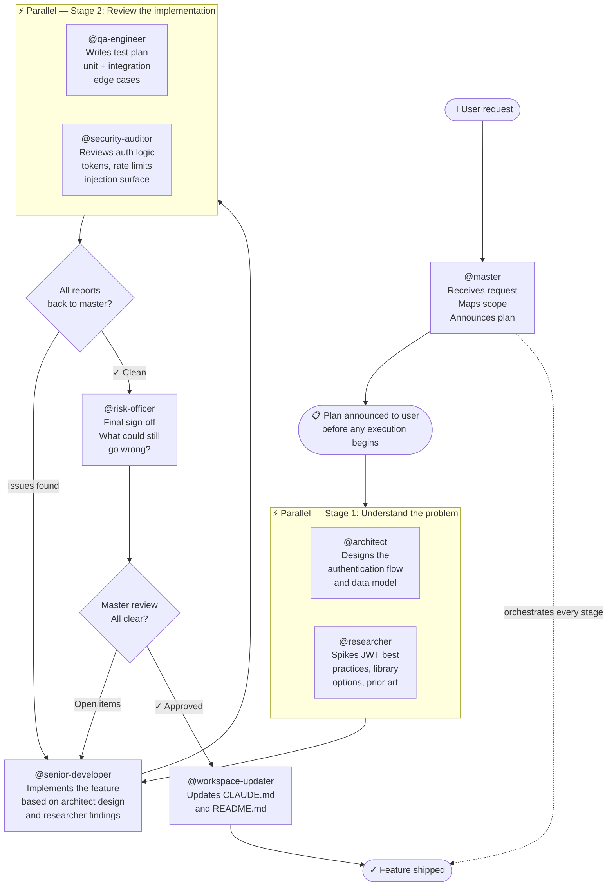
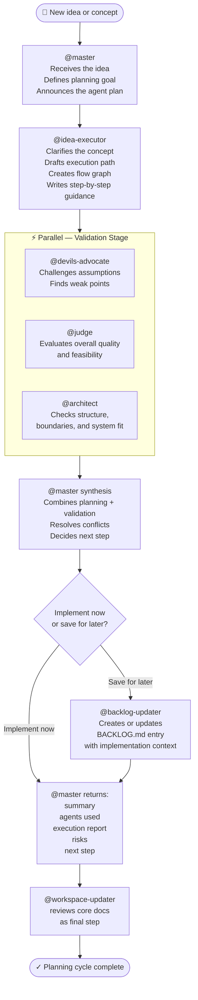

# Agent Workflows

All work flows through `@master`. Every example below starts and ends there.

`@master` receives the request, maps the full scope, announces the plan to the user before executing, dispatches agents (in parallel or sequentially depending on dependencies), synthesises their reports, resolves conflicts, and — once the user confirms — triggers `@workspace-updater` as the mandatory final step.

Four workflows are documented here, each demonstrating different collaboration patterns:

1. **Engineering Pipeline** — parallel spikes, sequential implementation, gated quality stages
2. **Content Publishing Pipeline** — research loop, human approval gate, parallel review, delivery feedback loop
3. **Full Project Launch** — dual parallel tracks (engineering + content) converging at a shared release gate
4. **Idea To Execution Planning** — idea shaping, adversarial validation, phased plan, optional backlog capture

---

## Workflow 1 — Engineering Pipeline

**Example trigger:** *"Add rate-limited authentication to the API"*

**Patterns demonstrated:** parallel research, sequential implementation, parallel QA + security, risk gate, workspace update.

**Key points:**
- `@architect` and `@researcher` run **in parallel** — they have no dependency on each other
- `@senior-developer` runs **after both** — it needs their outputs
- `@qa-engineer` and `@security-auditor` run **in parallel** — both review the same implementation independently
- `@master` collects both reports and resolves any conflicts before passing to `@risk-officer`
- Failed gates loop back — `@master` routes to the appropriate fix stage rather than starting over

---

## Workflow 2 — Content Publishing Pipeline

**Example trigger:** *"Plan and publish next week's newsletter"*

**Patterns demonstrated:** backlog-first research, human approval gate, parallel multi-reviewer stage, delivery execution, post-send feedback loop back to planning.

**Key points:**
- `@backlog-curator` runs **before** research — existing knowledge shapes what gets researched
- `@content-planner` and `@source-verifier` run **in parallel** — planning and validation are independent at this stage
- The **human approval gate** is explicit — no writing starts on an unapproved plan
- Three reviewers run **in parallel** — `@master` collects all three reports, resolves any conflicts, and decides pass/fail as a single gate
- The **feedback loop** is structural — `@feedback-synthesizer` routes back to `@backlog-curator` and closes the cycle

---

## Workflow 3 — Full Project Launch

**Example trigger:** *"Ship the new feature and announce it publicly"*

**Patterns demonstrated:** dual parallel tracks (engineering and content), converging release gate, post-launch experimentation, mandatory privacy scan, changelog, workspace update.

**Key points:**
- Both tracks start **simultaneously** — `@master` dispatches them at the same moment
- Neither track knows about the other — `@master` is the only entity holding both
- `@master` **converges** both tracks before the shared gate — it waits for the slower track rather than letting one proceed alone
- `@devils-advocate` runs **after** privacy review — it challenges the entire plan at the last responsible moment
- The human final approval gate is the last checkpoint before any irreversible public action
- `@delivery-orchestrator`, `@changelog-writer`, and `@ab-tester` run **in parallel** post-approval — none depend on each other

---

## Workflow 4 — Idea To Execution Planning

**Example trigger:** *"We have an idea for a backlog system and an execution-planning specialist. How should we shape it?"*

**Patterns demonstrated:** idea shaping, adversarial review, coordinated planning, optional backlog persistence, mandatory synthesis by `@master`.

**Key points:**
- `@idea-executor` is the primary planning specialist, not the top-level coordinator
- `@master` still owns the thread, announces the selected agents, and synthesizes the result
- `@devils-advocate`, `@judge`, and `@architect` are strong default validators for non-trivial ideas
- If the user wants to defer execution, `@backlog-updater` persists the idea in `BACKLOG.md`
- Even planning-only work still ends with `@workspace-updater` reviewing the core docs

---

## Reading These Diagrams

| Symbol | Meaning |
|---|---|
| `⚡ Parallel — Stage N` subgraph | Agents in this box run at the same time |
| Arrow `A → B` | B waits for A to complete |
| Diamond `{ }` labelled "Master synthesis" | `@master` collects reports, resolves conflicts, decides next step |
| Diamond `{ }` labelled "👤 Human approval" | Execution pauses — a human must decide before work continues |
| Dashed arrow `-.->` | `@master`'s continuous orchestration role across all stages |
| `(opus)` in node label | Agent uses the `claude-opus` model for higher-quality output |
| Loop arrow back | Gate failed — routes back to the appropriate fix stage |
