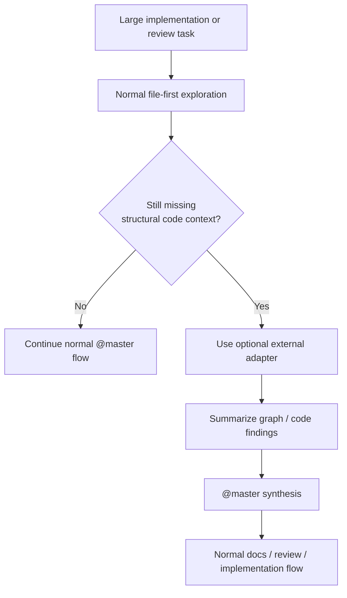

# Code-Review-Graph Adapter Example

This document shows how a tool like `code-review-graph` could fit `claude-team-kit` as an **optional external adapter**.

It is an example path, not a required integration.

## Purpose

The goal is to make the code-intelligence boundary more concrete:
- when this kind of tool is worth considering
- what stays outside the shared core
- how `@master` should think about the results

## Why This Is The First Example

Of the reviewed external repos, `code-review-graph` is the strongest near-term fit because it offers:
- local-first code graphing
- code-review and navigation workflows
- token-efficient structural lookup
- a clear “advanced optional tool” shape

That makes it the best real-world example for the adapter model described in `docs/CODE_INTELLIGENCE_INTEGRATION.md`.

## What Problem It Solves

This kind of adapter helps when a repo is large enough that normal file-first exploration starts getting expensive.

Good examples:
- tracing implementation paths across many modules
- finding the real usage/dependency surface around a risky change
- summarizing structurally relevant code for a large review
- helping multiple agents share tighter implementation context

## What Stays Outside The Shared Core

The shared core should **not** absorb:
- the indexer
- the graph backend
- the MCP server implementation
- installation scripts
- a required review runtime

Those stay external.

The shared core should only document:
- when the adapter is worth using
- what kind of lookup it provides
- how to summarize the output safely

## Where It Fits In The Existing Model

Use this split:

- `docs/GRAPH_INTELLIGENCE.md`
  - artifact relationships

- `docs/CODE_INTELLIGENCE_INTEGRATION.md`
  - the generic boundary for code-aware lookup

- this document
  - one concrete example of an optional external adapter

## Recommended Integration Shape

The first supported shape should be:

1. repo remains fully usable without the adapter
2. adapter is installed only by repos that want it
3. results are summarized back into normal markdown workflows
4. `@master` stays the orchestrator

That means:
- no required install step in setup
- no assumption that every user has the tool
- no change to the shared-core identity

## How `@master` Should Use It

If a repo intentionally installs an adapter like this, `@master` should:
- prefer normal repo reading first
- reach for the adapter only when the task genuinely needs code-aware structure
- summarize findings instead of dumping raw graph output
- treat the adapter as optional evidence, not as the source of truth for every task

## Example Optional Workflow

## Interaction With Context-Efficiency Rules

This kind of adapter should improve context efficiency, not weaken it.

That means:
- use it when it reduces repeated manual exploration
- summarize the useful result
- do not pass large raw dumps back into the main thread unless truly necessary

## Interaction With Cross-Tool Portability

This is an adapter example, not a portability promise.

So the public stance should stay:
- portable core
- optional host/tool adapter
- no mandatory dependency

## When To Recommend It

Recommend a tool in this class only when:
- the repo is large or structurally dense
- repeated implementation lookup is costly
- the team actually wants deeper code-aware exploration
- the maintenance overhead is acceptable

Do not recommend it when:
- `rg`, docs, and normal reading are still enough
- the task is mostly about artifact relationships rather than code structure
- the repo would gain more from clearer docs or project DNA than from indexing

## Practical Recommendation

Treat `code-review-graph` as the model example for:
- optional
- external
- advanced
- summarization-friendly

That gives the kit one concrete intelligence story without making external graph tooling part of the required core.
