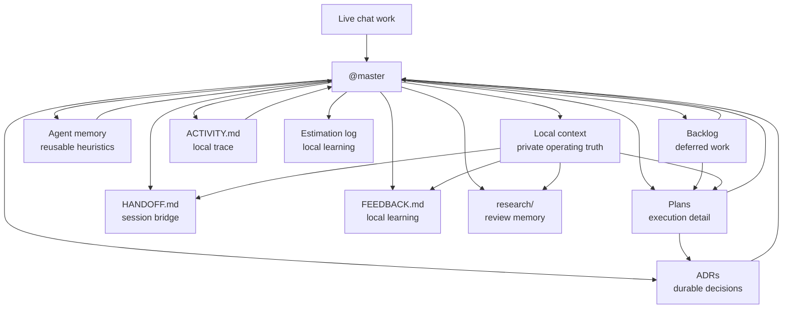

# Durable Memory

## Purpose

This kit needs continuity, but it should not turn into a bloated memory platform.

The durable-memory model defines:
- which artifacts hold continuity
- what should stay tracked versus local
- how `@master` and specialists should retrieve memory safely
- what future memory expansion could look like without changing the current repo boundary

## Core Principle

Use the lightest durable artifact that solves the continuity problem.

Prefer:
- tracked memory for reusable heuristics
- tracked docs for safe operating truth
- local context for private current reality
- plans and ADRs for durable execution and decision traceability
- handoff artifacts for short-lived session continuity

Avoid:
- turning every chat recap into permanent memory
- mixing private operating detail into tracked docs
- storing active product or company strategy in tracked agent memory
- adding a database or runtime memory substrate before the markdown-first model is clearly insufficient

## Memory Layers

| Layer | Purpose | Default Location | Visibility | Best For |
|---|---|---|---|---|
| Agent memory | Reusable heuristics and role-specific lessons | `.claude/agent-memory/<agent>/MEMORY.md` | tracked | patterns that should help the same role across repos or sessions |
| Backlog | Deferred-work memory | `BACKLOG.md` or `docs/BACKLOG.md` | local or tracked | future work, follow-ups, captured ideas |
| Plans | Execution memory | `.claude/local-context/plans/` or `docs/plans/` | local by default | how approved work should be carried out |
| ADRs | Decision memory | `docs/adr/` | tracked with approval | durable architecture, policy, or workflow decisions |
| Local context | Private operating memory | `.claude/local-context/` | local only | company, customer, POC, product, and strategy context |
| Handoff | Session-bridge memory | `.claude/local-context/HANDOFF.md` | local only | where work stopped and what the next model should know |
| Activity log | Local trace memory | `.claude/local-context/ACTIVITY.md` | local only | compact index of significant orchestration sessions |
| Feedback log | Local learning memory | `.claude/local-context/FEEDBACK.md` | local only | objective notes on what did not work well and why |
| Research notes | Local review memory | `.claude/local-context/research/` | local only | external repo/tool/image review memos and ecosystem scans |
| Estimation log | Practical learning memory | `.claude/local-context/estimation-log.md` | local only | estimate-versus-actual history and mode preferences |

Customized repos may also choose an optional project-DNA artifact when durable repo identity and operating assumptions no longer fit cleanly inside the hot-path briefings.
See [`docs/PROJECT_DNA_AND_STATE.md`](docs/PROJECT_DNA_AND_STATE.md) for that boundary.

## Memory Flow

This is the operating picture:
- chat starts the work
- `@master` routes it into the right durable artifact
- tracked artifacts preserve reusable or approved truth
- local artifacts preserve sensitive or short-lived truth

## Retrieval Model

The retrieval rule should stay narrow and intentional.

`@master` and specialists should:
1. start from the smallest relevant memory surface
2. read only the layer that matches the task
3. widen only when the task really needs more context
4. prefer durable artifacts over rebuilding the same context from chat

Examples:
- backlog or prioritization question -> read backlog first, then roadmap if sequencing matters
- durable technical decision -> read related ADRs first
- private founder or product question -> read only the relevant local-context file
- repeated role-specific judgment -> read the agent's own `MEMORY.md`
- unfinished session -> read `HANDOFF.md` before pulling broad context back in
- "what happened recently?" -> read `ACTIVITY.md` if the repo uses it, then follow links to backlog, plans, ADRs, handoff, or research notes as needed
- "what has been going wrong or causing confusion?" -> read `FEEDBACK.md` if the repo uses it before repeating the same weak workflow
- "what did we already learn from external references?" -> read `.claude/local-context/research/` before re-running the same ecosystem scan

## Example Use

Example: a founder asks, "What should we do next for this product repo?"

The preferred read order is:
1. local `docs/ROADMAP.md` for sequencing
2. `BACKLOG.md` for concrete open work
3. relevant local POC or company notes in `.claude/local-context/`
4. agent memory only when reusable heuristics from a role actually matter

That keeps current private reality in the right place instead of overloading tracked memory with active strategy.

## Tracked Versus Local

The boundary is simple:

Tracked memory should hold:
- reusable heuristics
- safe operating truth
- approved durable decisions
- public-safe reference examples

Local memory should hold:
- current company or customer reality
- private product or proof-of-concept work
- current roadmap detail and sequencing bets
- estimate-versus-actual history that reveals working habits
- short-lived or sensitive handoff context

If something is both useful and sensitive:
- keep it local first
- promote only a safe summary if the user explicitly wants that

## How We Actually Achieve Durability

Durability comes from combining multiple small memory surfaces instead of relying on one giant brain.

The practical recipe is:
- `@master` proposes ADRs for durable decisions
- `@backlog-updater` keeps deferred work out of chat-only history
- plans capture approved execution detail
- `.claude/local-context/` carries private operating truth
- agent memory captures reusable role-specific patterns
- `@workspace-updater` keeps the tracked hot path aligned when behavior changes
- `HANDOFF.md` bridges unfinished sessions without inflating stable docs
- `ACTIVITY.md` can provide a compact local-only trace of significant sessions when a repo benefits from it
- `FEEDBACK.md` can preserve objective workflow misses, expectation gaps, and corrective actions without polluting tracked docs
- `research/` can preserve external repo, tool, image, and ecosystem reviews without promoting raw research into tracked docs

## Backlog + Linked Plan Flow

Use this flow when an idea is important enough to preserve but too detailed for a single backlog row.

Default behavior:
1. `@idea-executor` shapes the idea into a concrete execution plan.
2. `@master` recommends `backlog + linked plan` when the work is substantial and deferred.
3. `@master` asks for explicit approval before saving the backlog row and plan.
4. `@backlog-updater` keeps the backlog row compact and links to the plan path.
5. The plan stores goal, scope, assumptions, phases, validation, risks, artifact visibility, and next action.

Visibility rule:
- use `.claude/local-context/plans/<slug>.md` for real likely-next implementation, strategy, sequencing, or company-operating work
- use `docs/plans/<slug>.md` only when the user explicitly wants a tracked plan and the plan is safe as a public reference
- approving the plan is not the same as approving tracked visibility

This makes continuity composable:
- decision continuity
- planning continuity
- private operating continuity
- session continuity
- role-specific heuristic continuity

## Privacy Model

Privacy is part of memory architecture, not a separate concern.

Rules:
- do not copy local context into tracked memory automatically
- do not store private roadmap or active POC detail in tracked agent memory
- keep tracked memory generic and reusable
- ask before promoting private facts into tracked docs or ADRs
- if unsure, keep the memory local

## Future Expansion

This model is intentionally markdown-first.

Future optional expansion could include:
- richer local indexes across backlog, plans, ADRs, and local context
- query helpers for local memory retrieval
- graph or repo-intelligence overlays
- app-backed memory browsing for a future product surface

But those should remain optional until the current artifact-based model clearly stops being enough.

## What This Enables

A strong durable-memory architecture lets the kit become:
- more continuous across sessions
- more useful across models and tools
- better at preserving real decisions and plans
- safer about public versus private context

Without becoming:
- a daemon runtime
- a hidden knowledge base that users cannot inspect
- a giant memory product by default
