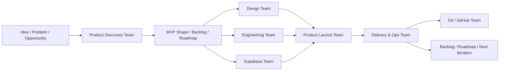

# Idea To Production

## Purpose

This guide explains how `claude-team-kit` should help a repo go from an initial idea to a shipped app or website without pretending every request needs a brand-new team or a giant runtime layer.

The goal is to make the journey visible enough that `@master` can proactively suggest the right workflow shape.

## Core Principle

The kit does not need a separate team for every phase name in a startup blog post.

It needs a small set of reusable team shapes that cover:
- idea clarification
- scope and MVP reduction
- design and implementation
- launch and follow-up

Everything else should mostly be combinations of existing teams.

## The Recommended Journey

## Which Teams Matter Most

### 1. Product Discovery Team

Use it when the user is still asking:
- what should we build?
- who is this for?
- what is the real MVP?
- what belongs in the first version versus later?

This is the missing bridge between "I have an idea" and "start coding now."

### 2. Design Team

Use it when the product direction exists but the surface still needs:
- information architecture
- onboarding or dashboard flows
- website structure
- trust, clarity, and visual direction

### 3. Engineering Team

Use it when the idea is specific enough to implement and the work is primarily:
- feature development
- architecture
- debugging
- integration

### 4. Supabase Team

Use it when the product path depends heavily on:
- auth
- schema
- RLS
- storage
- edge functions

### 5. Product Launch Team

Use it when the question is no longer just "how should this work?" but:
- can we actually ship this website or app?
- what is the smallest launchable surface?
- what gates must pass before go-live?

This is the missing bridge between implementation and an actual launch surface.

### 6. Delivery & Ops Team + Git / GitHub Team

Keep these as explicit quality and release surfaces rather than burying them inside a softer "launch" label.

They remain important for:
- release readiness
- public-output safety
- monitoring
- follow-up capture

## What Is Needed

The kit should visibly support:
- idea shaping
- MVP reduction
- backlog and roadmap creation
- website and app surface design
- implementation
- auth/data/backend integration when needed
- launch gates
- deployment follow-up and iteration

## What Is Not Needed Yet

The kit does **not** need separate first-class teams for all of these right now:
- growth team
- marketing team
- frontend-only team
- startup team
- investor team
- sales team

Those may matter in downstream product repos, but the shared kit should stay reusable and lean.

Most of those needs are better handled by:
- existing teams
- project-specific overlays
- or future downstream domain packs

## How `@master` Should React

When a user says things like:
- "I have an idea for an app"
- "help me build this website from scratch"
- "take this from concept to MVP"
- "what teams do we need to get this shipped?"

`@master` should not only route narrowly by specialty.

It should also propose a lifecycle path such as:
1. `Product Discovery Team`
2. `Design Team` and/or `Engineering Team`
3. `Product Launch Team`
4. `Delivery & Ops Team` plus `Git / GitHub Team` when shipping is imminent

## How This Fits The Rest Of The Repo

This guide does not replace:
- `docs/TEAMS.md`
- `docs/AGENT_WORKFLOWS.md`
- `docs/PROJECT_CUSTOMIZATION.md`

It gives the kit one visible answer to:
- how do we move from idea to shipped product?

Use it as the high-level orchestration answer, then let the other docs provide the deeper operating detail.
