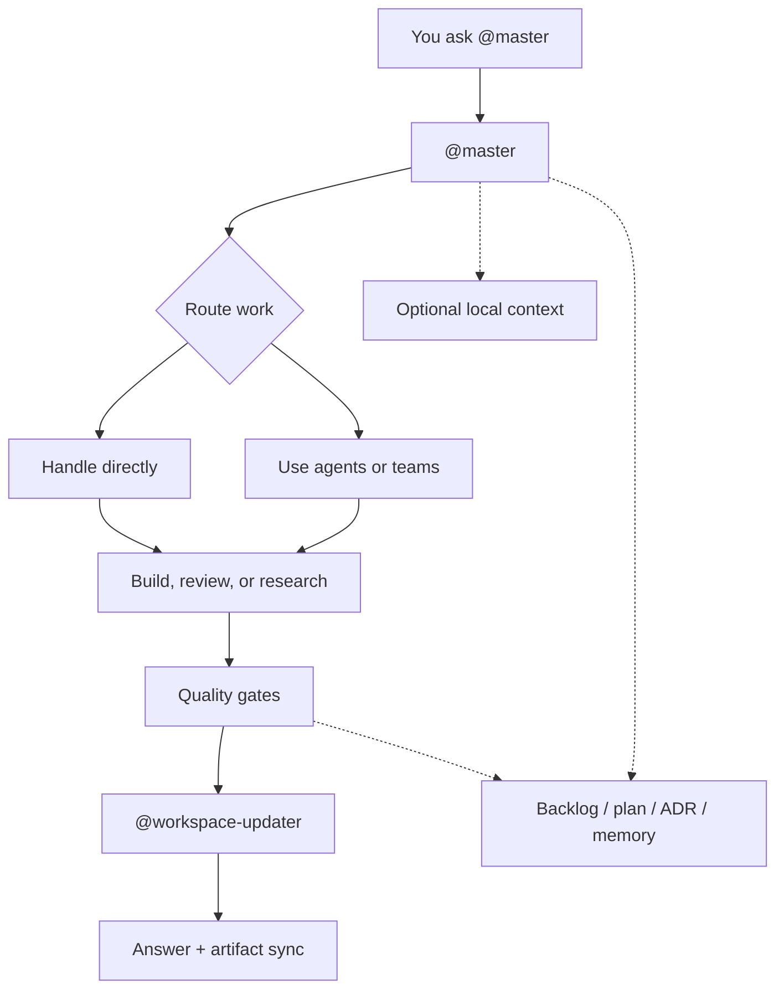

# Claude-Team-Kit One-Pager

## What This Repo Is

`claude-team-kit` is a reusable workspace kit for Claude-style coding tools.

It gives a repo:
- one top-level orchestrator: `@master`
- a reusable specialist team
- commands, skills, rules, hooks, and memory
- a clean split between tracked public truth and local private working truth

It is meant to be copied into real repos, customized quickly, and then used as the operating layer for AI-assisted engineering work.

## What It Does

In one sentence:

It helps a repo go from generic AI chat usage to a structured, professional operating system for coding, planning, review, and delivery.

More concretely, it provides:
- reusable agents and teams
- bootstrap and customization workflows
- quality gates for code, docs, and GitHub work
- durable memory and artifact guidance
- optional starter packs, solution packs, and design packs
- optional future-facing boundaries for graph intelligence, code intelligence, external adapters, skill distribution, app surfaces, and host portability

## How It Works

Everything flows through `@master`.

`@master`:
- receives the request
- chooses the right agents or teams
- decides what can run in parallel and what must stay sequential
- synthesizes the result
- triggers `@workspace-updater` as the final doc-impact gate

The repo itself stays file-first:
- `.claude/` is the canonical implementation surface
- `README.md`, `CLAUDE.md`, and `AGENTS.md` are the high-signal briefings
- deeper architecture and workflow detail lives in `docs/`
- private operating truth can live in `.claude/local-context/`

## Core Model

## The Main Layers

1. `Core orchestration`
   `@master`, specialist agents, reusable teams

2. `Workflow layer`
   commands, skills, rules, hooks, validation

3. `Artifact layer`
   backlog, plans, ADRs, docs, memory, local context

4. `Optional extension layer`
   starter packs, solution packs, design packs, graph boundary, code-intelligence boundary, external adapter policy, skill-repo guidance, cross-tool portability

## What It Is Not

This repo is **not**:
- a required runtime daemon
- a desktop app
- a background orchestration engine
- a mandatory graph or vector platform

Those may inspire future optional layers, but the shared core stays lightweight and repo-native.

## Best Use Case

Use this repo when you want:
- a stronger AI collaboration model inside a real project
- reusable specialist behavior without rebuilding it from scratch
- cleaner planning, review, and delivery loops
- a kit that can become project-specific without losing its shared core

## Why It Matters

Without a kit like this, most AI-assisted repos drift into:
- vague prompts
- inconsistent review habits
- weak continuity
- ad hoc docs
- poor reuse across projects

This repo exists to turn that into:
- structured orchestration
- reusable workflows
- safer quality gates
- clearer memory and documentation
- better long-term maintainability

## Short Version

`claude-team-kit` is a reusable AI workspace operating layer:
- one orchestrator
- many specialists
- strong workflow rules
- durable artifact discipline
- optional extensions when the repo actually needs them
