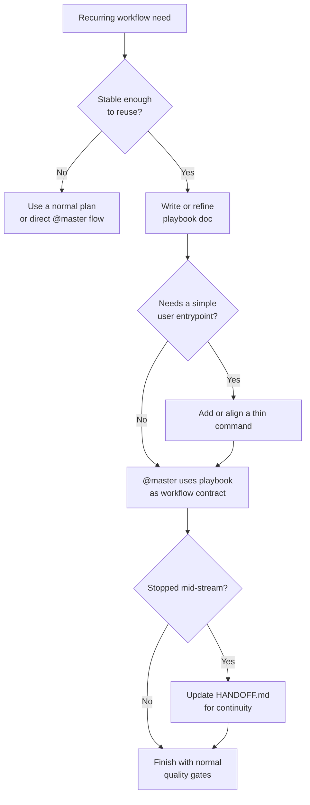

# Playbooks And Batch Workflows

This guide explains how `claude-team-kit` should represent repeatable multi-step workflows without turning the repo into a runtime orchestrator.

The goal is:
- make stable workflows easier to repeat
- separate one-off planning from durable operating patterns
- give `@master` a cleaner way to reuse known sequences

The goal is **not**:
- building a second command system
- replacing skills, commands, plans, or backlog
- pretending the kit executes autonomous workflow pipelines on its own

## Core Position

Use a **playbook** when the workflow shape is stable and worth reusing.

Use a **batch workflow** when the same playbook is being applied across multiple targets or repeated units of work.

Keep both file-based and guidance-first unless real repetition justifies helper tooling later.

## What A Playbook Is

A playbook is a durable, repeatable workflow artifact that explains:
- the sequence of steps
- the entry conditions
- the expected outputs
- the quality gates
- the handoff points

Examples:
- release-check flow
- repo-customization pass
- migration review
- audit-and-remediation loop
- repeated documentation sync flow

The important idea is:
- a command is how the user enters
- a playbook is the durable repeatable workflow behind that entry

## What A Batch Workflow Is

A batch workflow is a controlled repetition of one playbook across multiple items.

Examples:
- reviewing a set of repos against the same checklist
- running the same customization pass across several copied workspaces
- processing a queue of structured maintenance tasks

Batch workflows should remain explicit:
- what items are in scope
- what playbook is being reused
- what success looks like

## How This Differs From Other Artifacts

| Artifact | Role | Use It When |
|---|---|---|
| `BACKLOG.md` | future work capture | the work is deferred or not yet shaped |
| `docs/plans/` or local plans | one initiative or decision path | the work needs execution planning but is not yet a stable repeatable pattern |
| `docs/adr/` | durable decision record | the repo needs to remember *why* a policy or structure changed |
| `.claude/local-context/HANDOFF.md` | session continuity | work stopped mid-stream and the next session needs a compact resume artifact |
| `.claude/commands/` | user-facing workflow entrypoints | users need a simple way to start a recurring kind of task |
| playbook docs | durable repeatable workflow contract | the sequence is stable enough to reuse across sessions or repos |

That difference matters:
- backlog captures intent
- plans shape a specific move
- handoff preserves unfinished context
- commands start workflows
- playbooks explain repeatable operating patterns

## Recommended Shape

The first public-safe playbook model should stay lightweight:

1. purpose
2. trigger
3. prerequisites
4. sequence
5. outputs
6. quality gates
7. common failure modes
8. follow-up or handoff rules

This keeps playbooks readable in docs and reusable by `@master` without inventing a runtime language.

## Relationship To Commands

Commands stay thin.

They should:
- point users toward the workflow
- clarify the intent
- route through `@master`

They should not become giant embedded process specs if a reusable playbook doc would keep the workflow cleaner.

The intended model is:
- command = trigger surface
- playbook = reusable workflow contract
- `@master` = orchestrator

## Relationship To Handoff

`HANDOFF.md` is already part of the process, but it serves a different job.

Use `.claude/local-context/HANDOFF.md` for:
- unfinished sessions
- tool or model switching
- compact “where we left off” continuity

Do **not** use it as:
- the stable operating workflow
- the backlog
- the roadmap
- the canonical repeatable process definition

A useful rule of thumb:
- if the information should survive as a reusable way of working, it belongs in a playbook
- if it only helps the next session resume work, it belongs in `HANDOFF.md`

## When Docs-Only Is Enough

Docs-only playbooks are enough when:
- the workflow is understandable without automation
- the work still benefits from human judgment
- the repetition is real but not high-volume
- the repo does not need a second execution surface

That is the default recommendation for this kit.

## When A Helper Might Be Justified Later

Only consider a helper or adapter later when all of these are true:
- the same playbook is being used repeatedly
- the repetitive parts are stable
- the helper would remove manual overhead without hiding the workflow
- the output remains reviewable and easy to debug

If those conditions are not true, keep the playbook as docs.

## Suggested Flow

## Practical Recommendation

Start with:
- a clear playbook contract
- docs-first workflow encoding
- thin command entrypoints only when they help
- `HANDOFF.md` for session continuity, not workflow definition

That gives the kit a better story for repeatable multi-step work without drifting into runtime orchestration.
