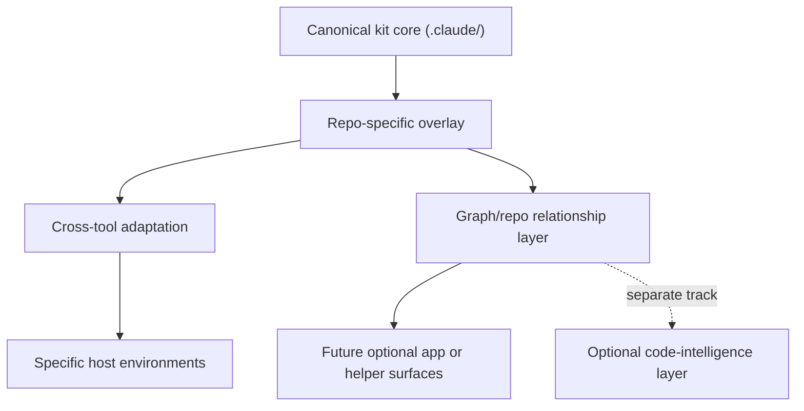

# Portability And Intelligence Overview

This document explains three closely related improvements to `claude-team-kit`:

1. the repo now treats `.claude/` as the only canonical implementation surface
2. the kit now has a clearer cross-tool portability contract
3. the optional graph/repo-intelligence layer is now separated from broader code-intelligence questions

Together, these changes make the repo easier to understand, easier to adapt, and less likely to drift into vague "future platform" territory.

## Why This Round Happened

As the kit grew, three risks started to show up:
- the leftover `.agents/` tree could confuse the mental model
- portability could become "support every tool somehow" instead of an intentional adapter strategy
- graph/repo intelligence could blur together with search, symbols, retrieval, and code-intelligence ideas

The repo needed clearer boundaries before adding more optional layers.

## 1. Canonical Surface Cleanup

The shared kit is now explicitly `.claude/`-first.

That means:
- `.claude/agents/`, `.claude/teams/`, `.claude/commands/`, `.claude/skills/`, `.claude/rules/`, and `.claude/hooks/` are the active implementation surfaces
- `README.md`, `CLAUDE.md`, and `AGENTS.md` are the always-visible briefing layer
- any leftover local `.agents/` tree is treated as legacy compatibility or archive material, not as part of the active model

This improves the repo because it removes ambiguity.

Before:
- it was possible to wonder whether `.agents/` still had an active compatibility role

After:
- there is one clear answer about where the real implementation lives

## 2. Cross-Tool Portability

The new portability stance is documented in `docs/CROSS_TOOL_PORTABILITY.md`.

The core idea is:
- keep one canonical shared kit
- customize the repo first
- adapt to a host second
- automate only the stable repetitive parts

The model is:
1. shared kit core
2. repo-specific overlay
3. optional tool-specific adapter

This improves the repo because portability is now intentional instead of fuzzy.

Before:
- "supporting other tools" could mean anything from docs guidance to fragile converters

After:
- the repo has explicit host tiers
- repo customization and tool adaptation are separated
- helper scripts need a real justification before they exist

## 3. Graph / Repo Intelligence Boundary

The graph/repo-intelligence layer is now treated as a relationship layer, not a catch-all intelligence bucket.

Its job is to help answer questions like:
- what artifacts connect to this operating surface?
- what should be read together?
- what is likely stale if this area changes?

It is not meant to answer broader implementation-search questions like:
- where is this symbol defined?
- what files depend on this module?
- what retrieval layer should index the codebase?

Those belong to a separate optional code-intelligence track.

This improves the repo because it preserves a useful lightweight layer:
- docs-first
- artifact-first
- optional

without forcing it to become:
- a search engine
- a graph database
- a runtime intelligence platform

## How These Layers Work Together

The clean mental model is now:

The important boundary is:
- portability decides how the kit adapts across hosts
- graph/repo intelligence decides how repo artifacts relate
- code intelligence, if pursued later, decides how to understand implementation detail

Those should not be collapsed into one "smart layer."

## What Improved In Practice

This round made the repo better in five concrete ways:

1. Clearer mental model
   There is now less ambiguity about what is canonical and what is legacy.

2. Safer portability
   The kit can grow toward more host support without drifting into tool-chasing.

3. Better sequencing
   `BL-044` and `BL-083` are no longer conceptually tangled.

4. Stronger docs
   The public architecture now explains not just what exists, but when optional layers are worth using.

5. Lower maintenance risk
   The repo can add optional helpers later without pretending they are already required core infrastructure.

## What This Does Not Mean

These changes do **not** mean:
- the repo now supports every host tool equally
- the kit has a built-in graph backend
- the repo has a code-intelligence engine already
- future optional layers should be implemented just because they are interesting

The point of this round was the opposite:
- keep the core honest
- keep optional layers bounded
- create room for future extensions without forcing them early

## What Comes Next

The next natural layer after this round is the separate optional code-intelligence track.

That track can now stay narrower and healthier because the repo already has:
- a canonical implementation boundary
- a cross-tool portability contract
- a relationship-layer boundary for graph/repo intelligence

So future work can ask a more precise question:

"Do we need optional code-aware search, symbol, dependency, or retrieval help?"

instead of:

"Should we add some vague intelligence thing?"
