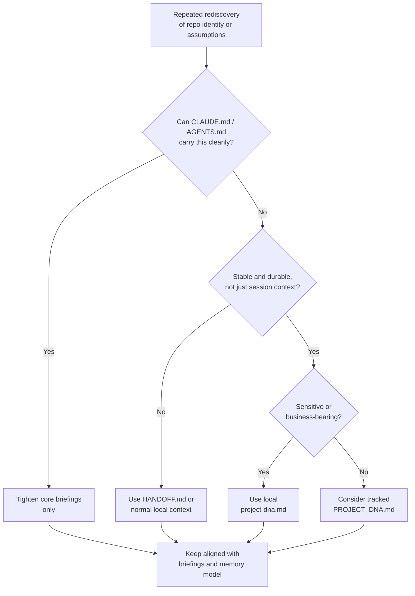

# Project DNA And State

This guide explains when a customized repo may benefit from an optional project DNA artifact, what it should contain, and how it should stay distinct from existing memory and briefing layers.

The goal is:
- preserve durable repo identity and operating assumptions
- reduce repeated rediscovery in long-running customized repos
- keep that identity lighter than a full strategy stack

The goal is **not**:
- creating another mandatory core file
- duplicating `CLAUDE.md`, `AGENTS.md`, or `README.md`
- replacing backlog, roadmap, plans, or `HANDOFF.md`

## Core Position

Most repos do **not** need a project DNA artifact immediately.

Only introduce one when the same durable repo identity, constraints, or operating assumptions are being rediscovered often enough that the current surfaces are no longer the cleanest fit.

The default should still be:
- `CLAUDE.md` and `AGENTS.md` for high-frequency working briefings
- `README.md` for human-facing repo orientation
- backlog, roadmap, plans, ADRs, and local context for their existing jobs

## What Project DNA Is

Project DNA is an optional identity-and-state artifact for customized repos.

It should answer questions like:
- what kind of repo is this, really?
- what durable assumptions shape how this repo operates?
- what patterns, boundaries, or constraints should not be rediscovered every few sessions?
- what makes this repo meaningfully specific beyond the generic kit?

Good DNA content:
- repo identity
- durable operating assumptions
- stable workflow patterns
- recurring architectural or delivery constraints
- important “do not reshape this casually” boundaries

## What It Is Not

Project DNA is not:
- the backlog
- the roadmap
- a session handoff
- a private strategy dump
- a replacement for `CLAUDE.md` or `AGENTS.md`
- a giant project wiki

If the content is:
- deferred work -> backlog
- sequencing -> roadmap
- one initiative -> plan
- durable decision rationale -> ADR
- private current reality -> local context
- unfinished session continuity -> `HANDOFF.md`

then it should stay in those surfaces.

## When It Is Worth It

Consider a project DNA artifact when:
- the repo is heavily customized and long-running
- onboarding churn keeps revealing the same missing identity context
- stable operating assumptions keep being repeated in chat or rewritten into temporary plans
- `CLAUDE.md` is at risk of bloating because it is carrying too much durable identity detail
- the repo has a distinct operating model that is more stable than a handoff but narrower than full private strategy

Do not add one when:
- the repo is still new or underdefined
- existing briefings already carry the needed signal clearly
- the information is mostly private and fast-changing
- the artifact would become a vague junk drawer

## Recommended Shape

The first version should stay compact.

Suggested sections:
1. purpose
2. repo identity
3. durable constraints
4. core operating assumptions
5. recurring workflow patterns
6. anti-goals or “do not drift here” notes
7. update triggers

That keeps the artifact useful without turning it into another sprawling reference doc.

## Location And Visibility

Use one of these shapes:

1. local DNA artifact
   - `.claude/local-context/project-dna.md`
   - best when the assumptions are sensitive, fluid, or business-bearing

2. tracked DNA artifact
   - `docs/PROJECT_DNA.md`
   - best when the assumptions are public-safe, stable, and genuinely helpful to collaborators

Default recommendation:
- use the local form first
- promote a tracked version only when the content is safe and stable enough

Do not keep both unless one is clearly a safe summary of the other.

## Relationship To Other Artifacts

| Artifact | Main Job | How It Differs From Project DNA |
|---|---|---|
| `README.md` | human repo introduction | broader orientation; less about durable operating assumptions |
| `CLAUDE.md` / `AGENTS.md` | hot-path working briefing | optimized for frequent use; should stay concise |
| `BACKLOG.md` | deferred work | future items, not repo identity |
| `docs/ROADMAP.md` | sequencing and phases | timing and order, not durable identity |
| plans | one approved initiative | execution detail, not stable repo state |
| ADRs | why a decision was made | decision record, not whole-repo identity |
| local context | private operating truth | may be broader, more sensitive, and more fluid |
| `HANDOFF.md` | session continuity | short-lived “where we left off,” not durable assumptions |

## How `@master` Should Recommend It

`@master` should recommend project DNA only when:
- repeated questions reveal the same missing repo-specific assumptions
- a repo is clearly customized enough that the generic kit layer is no longer the main missing context
- a stable identity artifact would reduce rediscovery better than further expanding `CLAUDE.md`

`@master` should not recommend it by default for every copied repo.

## How `@workspace-updater` Should Treat It

If a repo intentionally uses a project DNA artifact:
- review it when repo identity or durable operating assumptions changed materially
- do not update it reflexively after every small task
- keep it aligned with the core briefings, not richer than necessary

## Suggested Flow

## Practical Recommendation

Treat project DNA as an optional pressure-release valve for mature customized repos.

Use it when:
- durable repo identity is real
- current surfaces are too scattered or repetitive
- the artifact can stay compact and distinct

Do not use it when:
- the repo is still better served by clearer briefings, plans, backlog, roadmap, or local context
- the artifact would become a second ungoverned memory bucket

That gives the kit a stronger story for persistent repo identity without bloating the shared core or weakening the current durable-memory model.
