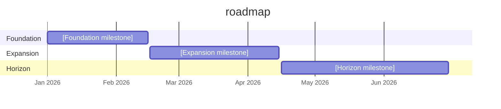

# Roadmap Template

Use this file as the starter for a local, repo-specific roadmap at `docs/ROADMAP.md`.

Recommended model:
- keep `docs/ROADMAP.example.md` tracked as the public template
- keep your real `docs/ROADMAP.md` local if it contains private sequencing, company priorities, or sensitive product planning

This template exists so the kit teaches the concept of a roadmap without forcing your real priorities into git history.

## Purpose

Use a local roadmap to answer:
- what happens first, next, later, and on the horizon
- how backlog items group into phases
- what the current operating priorities actually are

## How To Read It

- roadmap phases are sequencing guides, not perfect promises
- backlog items are the granular work registry
- plans hold the execution detail

## Suggested Sections

### Current Product Arc

Describe the major layers or stages of growth.

Example:
1. foundation
2. ergonomics
3. domain expansion
4. operating-model growth
5. productization

### Phased Roadmap

| Phase | Window | Status | Goal | Key Outcomes | Backlog Anchors |
|---|---|---|---|---|---|
| Phase 0 | [window] | `Done` / `Next` / `Planned` | [goal] | [outcomes] | [items] |
| Phase 1 | [window] | `Next` / `Planned` | [goal] | [outcomes] | [items] |
| Phase 2 | [window] | `Planned` / `Horizon` | [goal] | [outcomes] | [items] |

### Timeline View

### What Is Most Important Next

List the top 2 to 4 priorities that matter most right now.

### Roadmap Governance

Define how roadmap updates should work.

Good defaults:
- use the vision as the direction filter
- use the roadmap as the sequencing filter
- keep the roadmap smaller and more stable than the backlog
- only promote roadmap-worthy work, not every idea

## Practical Guidance

- keep the roadmap directional, not task-dense
- align backlog timing with roadmap phases where possible
- let plans carry execution depth
- keep private sequencing local unless you explicitly want it tracked
