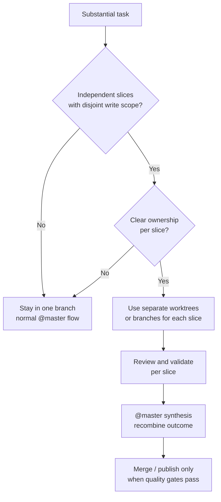

# Worktree Parallel Execution

This guide explains when `claude-team-kit` should recommend git worktrees for parallel work, how `@master` should frame them, and what boundaries keep that parallelism safe.

The goal is:
- safer parallel execution
- cleaner write-scope separation
- less branch thrash in larger tasks

The goal is **not**:
- turning the kit into a terminal or worktree manager
- requiring worktrees for normal work
- pretending every multi-agent task should become parallel branch choreography

## Core Position

Worktrees are an optional coordination technique for larger or more parallelizable work.

Use them when they make the workflow safer and clearer.

Do not use them just because parallelism sounds impressive.

## When Worktrees Are Worth It

Worktrees are most useful when:
- two or more implementation tracks have disjoint write scopes
- one track can continue while another is waiting on review or validation
- a larger feature has naturally separate modules or surfaces
- the user wants to explore alternative implementations without destabilizing the main branch
- a repo has enough active work that one working tree is becoming coordination friction

Good examples:
- one agent updates docs while another updates tests and validation
- one branch handles a pack contract while another handles the first concrete pack
- one branch explores an architecture option while another keeps shipping low-risk maintenance

## When Worktrees Are Not Worth It

Do not recommend worktrees when:
- the task is small and linear
- the write scope overlaps heavily
- the user only wants one focused change
- the repo is already coordination-light and a second branch would add overhead
- the bottleneck is understanding, not execution

## How `@master` Should Think About It

`@master` should recommend worktrees only when all of these are true:
- the task is substantial enough to benefit from separation
- the work can be decomposed into genuinely independent slices
- each slice has a reasonably clear owner or workflow
- the review and merge path will still be understandable afterward

If those conditions are not true, stay in one branch and keep the flow simpler.

## Safe Parallelism Rule

The default rule is:

- parallelize understanding freely when there is no shared write scope
- parallelize implementation only when write ownership is explicit
- merge only after review, validation, and synthesis are clear

If the write set is not clearly separable, do not split it into parallel worktrees.

## Suggested Flow

## Branch And Review Boundaries

When worktrees are used:
- each worktree should map to one clear slice of work
- each slice should have a clear review story
- each branch should still be understandable without reading every other branch first

Prefer:
- one purpose per worktree
- one reviewable unit per branch
- one clear merge sequence

Avoid:
- vague "misc" branches
- multiple overlapping refactors in parallel
- unreviewable stacks of hidden cross-dependencies

## Relationship To The Git / GitHub Quality Gate

Worktrees do not weaken the existing quality gate.

The same expectations still apply:
- `@github-safety-guard`
- `@code-reviewer`
- `@qa-engineer`
- `@production-readiness-reviewer` when risk justifies it

Parallel work should still converge into:
- understandable diffs
- explicit validation
- safe merge or push decisions

## Relationship To `@master`

`@master` remains the orchestrator.

That means:
- `@master` decides whether worktrees are worth recommending
- `@master` should explain why parallelism is helping
- `@master` should keep the synthesis readable after the branches or worktrees converge

Worktrees are a coordination aid, not a second orchestration system.

## Practical Recommendation

Default to one branch.

Reach for worktrees only when:
- the work is large enough
- the slices are truly separable
- the write scopes are explicit
- the merge story remains clean

That gives the kit a safer story for parallel execution without forcing runtime orchestration into the shared core.
