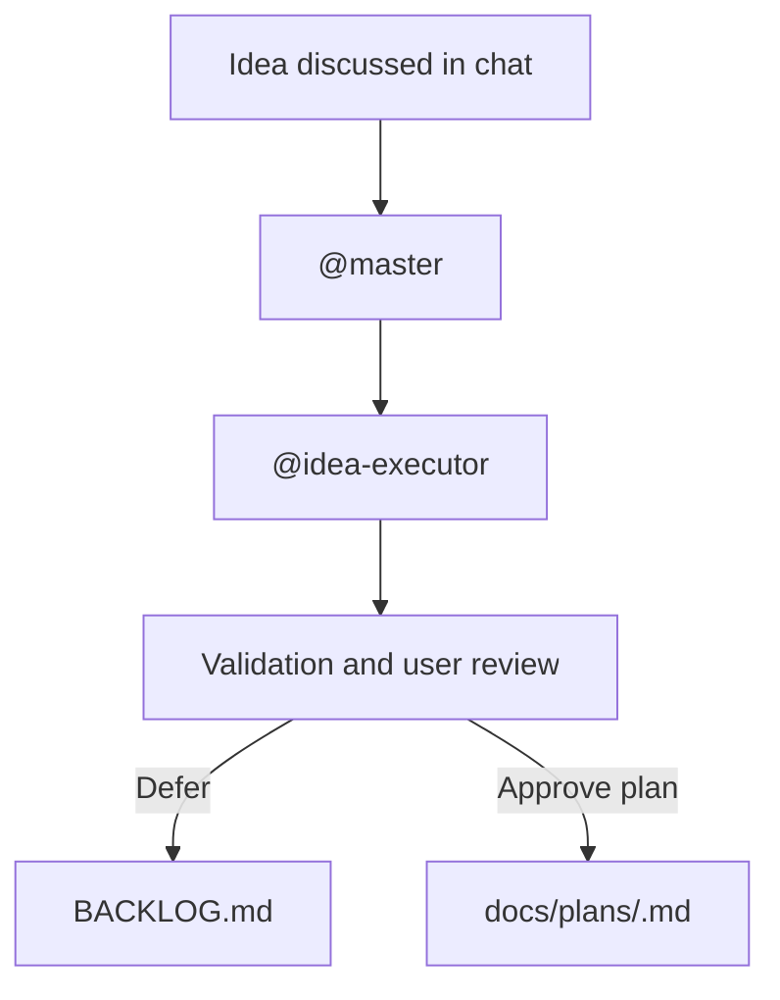

# Example Execution Plan

## Idea Summary

Add a reusable backlog workflow so ideas discussed in chat can be captured consistently and revisited later.

## Artifact Decision

- Type: `docs/plans/`
- Status: Example only
- Approval: Required before saving real project plans

## Goal

Create a durable, low-friction way to move from idea discussion to a structured execution plan.

## Assumptions

- `@master` remains the only top-level orchestrator
- deferred work should live in `BACKLOG.md`
- approved execution plans should live in `docs/plans/`

## Execution Plan

1. Define a stable backlog schema.
2. Add a specialist that updates the backlog.
3. Add a planning specialist that shapes ideas into execution plans.
4. Update orchestration and validation rules.

## Flow Graph

## Success Criteria

- ideas are not lost
- saved plans are easy to find
- users explicitly approve saved planning artifacts
